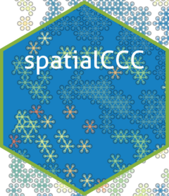

<!-- README.md is generated from README.Rmd. Please edit that file -->

```{r, include = FALSE}
knitr::opts_chunk$set(
  collapse = TRUE,
  comment = "#>",
  fig.path = "man/figures/README-",
  out.width = "100%"
)
```

# spatialCCC 

<!-- badges: start -->

[](https://github.com/dolchan/spatialCCC/actions/workflows/R-CMD-check.yaml)

<!-- badges: end -->

The goal of **spatialCCC** package is to investigate cell-cell signaling, by analyzing ligand-receptor interactions in spatial transcriptomic data.

## Installation

You can install the development version of spatialCCC from [GitHub](https://github.com/) with:

``` r
# install.packages("devtools")
devtools::install_github("dolchan/spatialCCC")
```

# Example

This is a basic example which shows you a basic workflow of the package:

### Load necessary packages

```{r message = FALSE}
library(SpatialExperiment)
library(scater)
library(dplyr)
library(tidyr)
library(magrittr)
library(purrr)
library(ggplot2)
library(patchwork)

library(ggraph)
library(tidygraph)
library(RColorBrewer)

library(ggtree)
```

### Load spatialCCC package

```{r example}
library(spatialCCC)
## basic example code
```

## Ligand-Receptor Database

### Load built-in LRdb

```{r}
LRdb_mm <- 
  get_LRdb("mouse")

LRdb_m <-
  LRdb_mm %>%
  slice_sample(n = 100)

LR_pair_list <- c(
  "Apoe_Sdc1",
  "App_Dcc",
  "Cxcl12_Ackr3",
  "Jam3_Itgam",
  "Cx3cl1_Itga4")

LRdb_m <-
  rbind(LRdb_m,
        dplyr::filter(LRdb_mm, LR %in% LR_pair_list)) %>%
  distinct()

LRdb_m %>% 
  arrange(ligand_gene_symbol, receptor_gene_symbol)
```

## Load Visium spatial transcriptomic data

```{r}
data_dir <- file.path("example", "visium_tutorial")
spe <- SpatialExperiment::read10xVisium(samples = data_dir, type = "HDF5", data = "filtered")
```

### Log-Normalize

```{r}
spe <- logNormCounts(spe) 
```

## Compute Cell-Cell Communications over ligand-receptor pairs

```{r}
# For full LRdb analysis, future::plan can be used 
#   for parallelization
# future::plan(future::multisession, workers = 4)

tictoc::tic()
ccc_tbl <- compute_spatial_ccc(spe = spe, 
                               assay_name = "logcounts",
                               LRdb = LRdb_m)
tictoc::toc()

# future::plan(future::sequential)
```

```{r}
ccc_tbl %>% 
  dplyr::arrange(desc(LRscore))
```

### Convert CCC table to CCC graph

The conversion also adds various graph metrics to each CCC graph.

```{r}
tictoc::tic("to_spatical_ccc_graph ...")

sp_col_data <- get_spatial_coords(spe)

ccc_graph_list <-
  to_spatial_ccc_graph_list(ccc_tbl, sp_col_data, workers = 4)

tictoc::toc()
```

summarize_ccc_graph_metrics() summarize those graph metrics for each LR pair.

```{r}
tictoc::tic()

ccc_graph_metrics_summary_df <-
  summarize_ccc_graph_metrics(ccc_graph_list)

tictoc::toc()
```

```{r}
ccc_graph_metrics_summary_df %>%
  arrange(graph_component_count)
```

summarize_ccc_graph_metrics(..., level = "group") summarizes the metrics for each subgraph (group) in CCC graph (LR)

```{r}
tictoc::tic()

ccc_graph_group_metrics_summary_df <-
  summarize_ccc_graph_metrics(ccc_graph_list, level = "group")

tictoc::toc()
```

```{r}
ccc_graph_group_metrics_summary_df 
```

## Visualization

```{r, fig.width=8}
LR_of_interest <- "App_Dcc"
```

### spatial CCC graph plot with tissue image

```{r, warning=FALSE}
plot_spatial_ccc_graph(ccc_graph = ccc_graph_list[[LR_of_interest]],
                       tissue_img = imgRaster(spe),
                       node_color = "group_diameter",
                       node_size = 1,
                       edge_color = "group_diameter",
                       which_on_top = "edge")
```

### spatial CCC graph plot without tissue image

In this case, graph layout can be "manual" which keeps the original spatial locations, or other graph layout algorithm supported by igraph package. Below uses "auto" layout ("kk" spring layout)

```{r, warning=FALSE}
plot_spatial_ccc_graph(ccc_graph = ccc_graph_list[[LR_of_interest]],
                       # tissue_img = imgRaster(spe),
                       node_color = "group",
                       node_size = 0.1,
                       edge_color = "group_diameter",
                       edge_width = 0.1,
                       which_on_top = "edge")
```

In this case, below is "stress" layout.

```{r, warning=FALSE}
plot_spatial_ccc_graph(ccc_graph = ccc_graph_list[[LR_of_interest]],
                       # tissue_img = imgRaster(spe),
                       graph_layout = "stress",
                       node_color = "group",
                       edge_color = "group_diameter",
                       edge_width = 0.25,
                       which_on_top = "edge")
```

```{r}
tictoc::tic()

cell_overlap_dist <-
  dist_cell_overlap_ccc_tbl(ccc_tbl)

tictoc::toc()
```

```{r}
tictoc::tic()

cell_overlap_lf <-
  lf_cell_overlap_ccc_tbl(ccc_tbl)

tictoc::toc()
```

```{r}
tictoc::tic()

LRs_high_cell_overlap <-
  cell_overlap_lf %>% 
  filter(d < 1) %>%
  select(lr1, lr2) %>%
  unlist() %>% unique()

tictoc::toc()
```

```{r}
tictoc::tic()

high_cell_overlap_dist <-
  cell_overlap_dist[LRs_high_cell_overlap, LRs_high_cell_overlap]

tictoc::toc()
```

```{r}
tictoc::tic()

high_cell_overlap_dist2 <-
  cell_overlap_lf %>%
  filter(d < 1) %>%
  select(lr1, lr2, d) %>%
  lf_to_dist()

tictoc::toc()
```

```{r}
LR_ccc_summary_tbl <-
  ccc_tbl %>% 
  pull(LR) %>%
  table() %>%
  as_tibble() %>%
  rename("LR" = ".") %>%
  arrange(desc(n)) %>%
  left_join(
    ccc_tbl %>% 
      select(LR, ligand, receptor) %>%
      distinct(),
    by = "LR"
  )
```

```{r}
hclus.res <- fastcluster::hclust(as.dist(high_cell_overlap_dist),
                                 method = "complete")
```

```{r, fig.width=8, fig.height=2}
#| warning: false
ape::as.phylo(hclus.res) %>%
  ggtree(layout="dendrogram") %<+% LR_ccc_summary_tbl +
  aes(color=receptor) +
  theme(legend.position = "none") +
  geom_tippoint(aes(size=n), alpha=0.5) +
  geom_tiplab(size=2, offset=-0.15) +
  xlim_tree(3)
```

```{r, fig.width=5, fig.height=5}
#| warning: false
ape::as.phylo(hclus.res) %>%
  ggtree(layout = "circular") %<+% LR_ccc_summary_tbl +
  aes(color=receptor) +
  # aes(color=ligand) +
  theme(legend.position = "none") +
  geom_tippoint(aes(size=n), alpha=0.5) +
  geom_tiplab(size=2, offset=0.05)
```

```{r, warning = FALSE}
gp_hex <-
  ccc_graph_list[[LR_of_interest]] %>%
  plot_spatial_ccc_graph(
    tissue_img = imgRaster(spe),
    clip = TRUE,
    node_color = "group",
    node_size = 1,
    edge_color = "group_n_edges",
    edge_width = 0.5,
    ghost_img = TRUE,
    which_on_top = "edge"
  ) +
  theme(legend.position = "none")

gp_hex
```

```{r}
library(hexSticker)
gp_hex_sticker <- sticker(
  gp_hex,
  package = "spatialCCC",
  # p_color = "#1F1F1F",
  p_color = "snow",
  p_family = "sans",
  p_fontface = "bold",
  p_y = 1.1,
  p_size = 40,
  
  s_x = 1.0,
  s_y = 1.2,
  s_width = 5,
  s_height = 5*3/4,
  
  # h_fill = "purple",
  h_color = "snow",
  h_size = 1.5,
  
  # spotlight = TRUE,
  # l_x = 1.0,
  # l_y = 0.4,
  # l_alpha = 0.25,
  
  filename = "spatialCCC.png",
  dpi = 600
)
```
