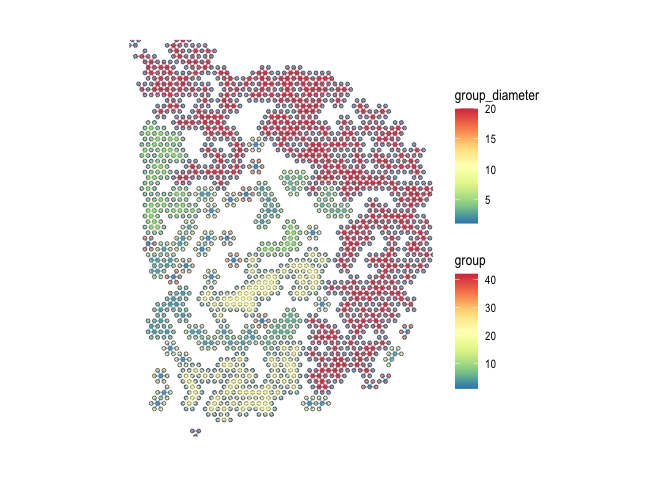
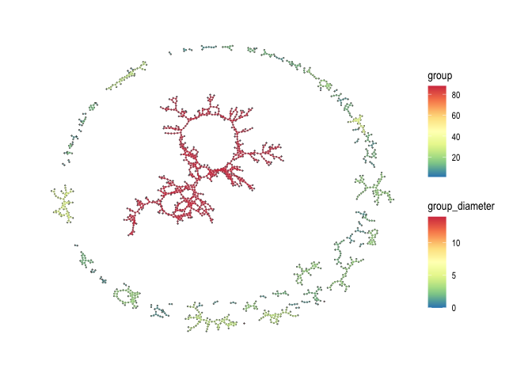

<!-- README.md is generated from README.Rmd. Please edit that file -->

# spatialCCC 

<!-- badges: start -->

[](https://github.com/dolchan/spatialCCC/actions/workflows/R-CMD-check.yaml)

<!-- badges: end -->

The goal of **spatialCCC** package is to investigate cell-cell
signaling, by analyzing ligand-receptor interactions in spatial
transcriptomic data.

## Installation

You can install the development version of spatialCCC from
[GitHub](https://github.com/) with:

``` r
# install.packages("devtools")
devtools::install_github("dolchan/spatialCCC")
```

## Example

This is a basic example which shows you a basic workflow of the package:

- First, load required R packages.

``` r
# Looks like ggraph might have some issue importing 'guide_edge_colourbar' 
# library(ggraph)

library(spatialCCC)
```

- Then, load built-in LR database.

``` r
LRdb_m <- 
  get_LRdb_small("mouse")
```

- Load an example Visium spatial transcriptomic data

``` r
data_dir <- file.path("example", "visium_tutorial")
spe_brain <-
  SpatialExperiment::read10xVisium(samples = data_dir,
                                   type = "HDF5",
                                   data = "filtered")

# Log-Normalize
spe_brain <- scater::logNormCounts(spe_brain)
```

### Cell-cell communication analysis

- Compute Cell-Cell Communications over ligand-receptor pairs

``` r
ccc_tbl <-
  compute_spatial_ccc(spe = spe_brain,
                      assay_name = "logcounts",
                      LRdb = LRdb_m)
```

- Convert CCC table to CCC graph The conversion also adds various graph
  metrics to each CCC graph.

``` r
sp_col_data <- get_spatial_data(spe_brain)

ccc_graph_list <-
  to_spatial_ccc_graph_list(ccc_tbl, sp_col_data, workers = 6)
```

### Cell-cell commuication visualization

- Spatial CCC graph plot with tissue image

``` r
LR_of_interest <- "App_Dcc"

plot_spatial_ccc_graph(
  ccc_graph = ccc_graph_list[[LR_of_interest]],
  tissue_img = SpatialExperiment::imgRaster(spe_brain),
  node_color = "group",
  node_size = 1,
  node_alpha = 0.5,
  edge_color = "group",
  # clip = TRUE,
  which_on_top = "edge"
)
```


- Spatial CCC graph plot without tissue image

In this case, graph layout can be “spatial” which keeps the original
spatial locations, or other graph layout algorithm supported by igraph
package.

``` r
plot_spatial_ccc_graph(
  ccc_graph = ccc_graph_list[[LR_of_interest]],
  graph_layout = "spatial",
  node_color =  "group",
  node_size = 1,
  edge_color = "group_diameter",
  clip = TRUE,
  which_on_top = "edge"
)
```



- Spatial CCC graph plot with “auto”, a.k.a., “kk” spring layout

In this format and the one below, one can see the distribution of
cell-cell communication clusters

``` r
plot_spatial_ccc_graph(
  ccc_graph = ccc_graph_list[[LR_of_interest]],
  node_color = "group",
  node_size = 0.1,
  edge_color = "group_diameter",
  edge_width = 0.1,
  which_on_top = "edge"
)
```



- Spatial CCC graph plot with “stress” layout

``` r
plot_spatial_ccc_graph(
  ccc_graph = ccc_graph_list[[LR_of_interest]],
  # tissue_img = SpatialExperiment::imgRaster(spe_brain),
  graph_layout = "stress",
  node_color = "group",
  edge_color = "group_diameter",
  edge_width = 0.25,
  which_on_top = "edge"
)
```


