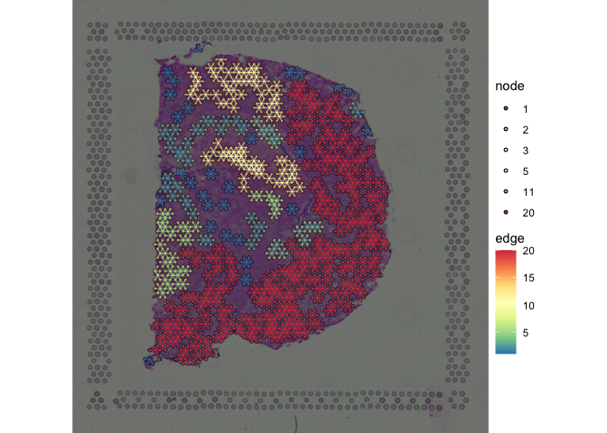
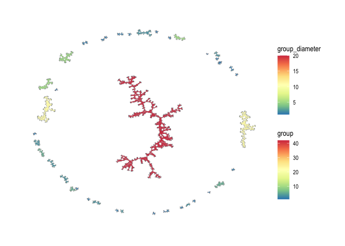
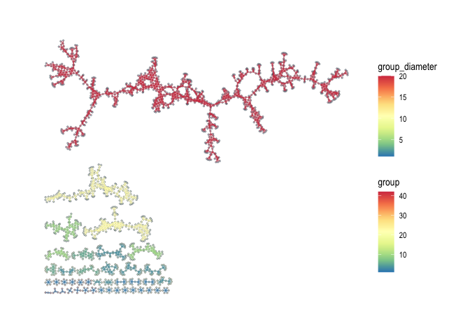
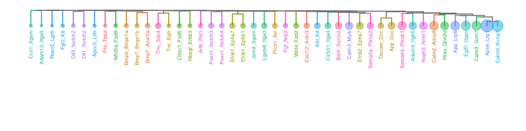
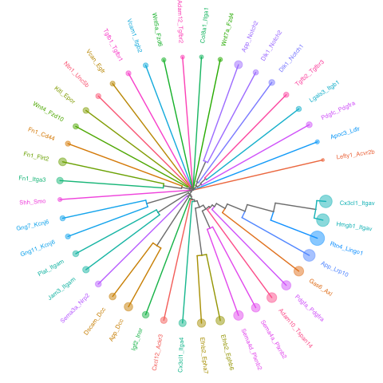

<!-- README.md is generated from README.Rmd. Please edit that file -->

# spatialCCC 

<!-- badges: start -->

[](https://github.com/dolchan/spatialCCC/actions/workflows/R-CMD-check.yaml)

<!-- badges: end -->

The goal of **spatialCCC** package is to investigate cell-cell
signaling, by analyzing ligand-receptor interactions in spatial
transcriptomic data.

## Installation

You can install the development version of spatialCCC from
[GitHub](https://github.com/) with:

``` r
# install.packages("devtools")
devtools::install_github("dolchan/spatialCCC")
```

# Example

This is a basic example which shows you a basic workflow of the package:

### Load necessary packages

``` r
library(SpatialExperiment)
library(scater)
library(dplyr)
library(tidyr)
library(magrittr)
library(purrr)
library(ggplot2)
library(patchwork)

library(ggraph)
library(tidygraph)
library(RColorBrewer)

library(ggtree)
```

### Load spatialCCC package

``` r
library(spatialCCC)
## basic example code
```

## Ligand-Receptor Database

### Load built-in LRdb

This LRdb is downloaded from CellTalkDB:
\[<http://tcm.zju.edu.cn/celltalkdb/download.php>\]. You can see the
detail by:

``` r
?LRdb_human
?LRdb_mouse
```

We also created getter function, get_LRdb(), to retrieve the database.

``` r
LRdb_m <- 
  get_LRdb_small("mouse")

LRdb_m %>% 
  arrange(ligand_gene_symbol, receptor_gene_symbol)
#> # A tibble: 105 × 10
#>    LR    ligand_gene_symbol receptor_gene_symbol ligand_gene_id receptor_gene_id
#>    <chr> <chr>              <chr>                         <dbl>            <dbl>
#>  1 Adam… Adam10             Fcer2a                        11487            14128
#>  2 Adam… Adam10             Tspan14                       11487            52588
#>  3 Adam… Adam12             Itgb1                         11489            16412
#>  4 Adam… Adam2              Itgb1                         11495            16412
#>  5 Apob… Apob               Lrp6                         238055            16974
#>  6 Apoe… Apoe               Sdc1                          11816            20969
#>  7 App_… App                Dcc                           11820            13176
#>  8 App_… App                Ngfr                          11820            18053
#>  9 Artn… Artn               Gfra3                         11876            14587
#> 10 Bmp7… Bmp7               Acvrl1                        12162            11482
#> # ℹ 95 more rows
#> # ℹ 5 more variables: ligand_ensembl_protein_id <chr>,
#> #   receptor_ensembl_protein_id <chr>, ligand_ensembl_gene_id <chr>,
#> #   receptor_ensembl_gene_id <chr>, evidence <chr>
```

## Load Visium spatial transcriptomic data

``` r
data_dir <- file.path("example", "visium_tutorial")
spe <- SpatialExperiment::read10xVisium(samples = data_dir, type = "HDF5", data = "filtered")
```

### Log-Normalize

``` r
spe <- logNormCounts(spe) 
```

## Compute Cell-Cell Communications over ligand-receptor pairs

``` r
# For full LRdb analysis, future::plan can be used 
#   for parallelization
# future::plan(future::multisession, workers = 4)

tictoc::tic()
ccc_tbl <- compute_spatial_ccc(spe = spe, 
                               assay_name = "logcounts",
                               LRdb = LRdb_m)
tictoc::toc()
#> 7.251 sec elapsed

# future::plan(future::sequential)
```

``` r
ccc_tbl %>% 
  dplyr::arrange(desc(LRscore))
#> # A tibble: 91,761 × 10
#>    src          dst       d norm.d LR    ligand receptor LRscore weight WLRscore
#>    <chr>        <chr> <dbl>  <dbl> <chr> <chr>  <chr>      <dbl>  <dbl>    <dbl>
#>  1 AGAAGTGATTC… AATG…  138    1.01 Calm… Calm1  Kcnq3      0.858  0.986    0.846
#>  2 TTGCATGCTGA… GTGC…  138.   1.01 Calm… Calm1  Kcnq3      0.858  0.980    0.840
#>  3 CCCAACATACG… GTGC…  138.   1.00 Calm… Calm1  Kcnq3      0.857  0.992    0.850
#>  4 CGGTGCAGATA… GTGC…  138    1.01 Calm… Calm1  Kcnq3      0.857  0.986    0.845
#>  5 GTGGTTTCCGC… GTGC…  138    1.01 Calm… Calm1  Kcnq3      0.857  0.986    0.845
#>  6 TCTGGGTAGCG… ACAT…  138.   1.01 Calm… Calm1  Kcnq3      0.857  0.987    0.845
#>  7 GGGAGGATGCC… CCAA…  138    1.01 Calm… Calm1  Kcnq3      0.855  0.986    0.843
#>  8 TTGCATGCTGA… ACAT…  137    1    Calm… Calm1  Kcnq3      0.855  1        0.855
#>  9 AGATACCGGTG… ACAT…  138.   1.01 Calm… Calm1  Kcnq3      0.855  0.980    0.837
#> 10 TTCTTATCCGC… AGTT…  138.   1.00 Calm… Calm1  Kcnq3      0.855  0.992    0.848
#> # ℹ 91,751 more rows
```

### Convert CCC table to CCC graph

The conversion also adds various graph metrics to each CCC graph.

``` r
tictoc::tic("to_spatical_ccc_graph ...")

sp_col_data <- get_spatial_coords(spe)

ccc_graph_list <-
  to_spatial_ccc_graph_list(ccc_tbl, sp_col_data, workers = 4)

tictoc::toc()
#> to_spatical_ccc_graph ...: 12.655 sec elapsed
```

summarize_ccc_graph_metrics() summarize those graph metrics for each LR
pair.

``` r
tictoc::tic()

ccc_graph_metrics_summary_df <-
  summarize_ccc_graph_metrics(ccc_graph_list)

tictoc::toc()
#> 0.061 sec elapsed
```

``` r
ccc_graph_metrics_summary_df %>%
  arrange(graph_component_count)
#> # A tibble: 46 × 12
#>    LR        graph_n_nodes graph_n_edges graph_component_count graph_motif_count
#>    <chr>             <int>         <dbl>                 <dbl>             <int>
#>  1 Egfl7_It…          2338          6933                     3             15373
#>  2 Calm1_Kc…          2697         11629                     3             24463
#>  3 Fgf12_Fg…          2512          9821                     4             21180
#>  4 Sema6d_N…          2511          8038                     4             18355
#>  5 Mdk_Lrp1           2588          8606                     5             19447
#>  6 Adam10_T…          2114          5046                     8             10890
#>  7 Vegfa_Sd…          1991          4353                    13              9112
#>  8 Sema4a_P…          1800          3511                    25              7024
#>  9 Flt3l_Fl…            78            46                    32                14
#> 10 Cxcl12_G…          1763          2760                    42              5310
#> # ℹ 36 more rows
#> # ℹ 7 more variables: graph_diameter <dbl>, graph_un_diameter <dbl>,
#> #   graph_mean_dist <dbl>, graph_circuit_rank <dbl>, graph_reciprocity <dbl>,
#> #   graph_clique_num <int>, graph_clique_count <int>
```

summarize_ccc_graph_metrics(…, level = “group”) summarizes the metrics
for each subgraph (group) in CCC graph (LR)

``` r
tictoc::tic()

ccc_graph_group_metrics_summary_df <-
  summarize_ccc_graph_metrics(ccc_graph_list, level = "group")

tictoc::toc()
#> 0.056 sec elapsed
```

``` r
ccc_graph_group_metrics_summary_df 
#> # A tibble: 3,501 × 12
#>    LR         group group_n_nodes group_n_edges group_adhesion group_motif_count
#>    <chr>      <int>         <int>         <dbl>          <dbl>             <int>
#>  1 Vwf_Itga2b     1            24            32              0                40
#>  2 Vwf_Itga2b     2            16            18              0                22
#>  3 Vwf_Itga2b    38             4             3              0                 3
#>  4 Vwf_Itga2b    11             8             7              0                12
#>  5 Vwf_Itga2b    39             4             3              0                 3
#>  6 Vwf_Itga2b    18             6             6              0                 8
#>  7 Vwf_Itga2b    12             8             7              0                 7
#>  8 Vwf_Itga2b    62             3             2              0                 1
#>  9 Vwf_Itga2b     6            11            13              0                23
#> 10 Vwf_Itga2b    89             2             1              0                 0
#> # ℹ 3,491 more rows
#> # ℹ 6 more variables: group_diameter <dbl>, group_un_diameter <dbl>,
#> #   group_mean_dist <dbl>, group_girth <dbl>, group_circuit_rank <dbl>,
#> #   group_reciprocity <dbl>
```

## Visualization

``` r
LR_of_interest <- "App_Dcc"
```

### spatial CCC graph plot with tissue image

``` r
plot_spatial_ccc_graph(ccc_graph = ccc_graph_list[[LR_of_interest]],
                       tissue_img = imgRaster(spe),
                       node_color = "group_diameter",
                       node_size = 1,
                       edge_color = "group_diameter",
                       which_on_top = "edge")
```



### spatial CCC graph plot without tissue image

In this case, graph layout can be “manual” which keeps the original
spatial locations, or other graph layout algorithm supported by igraph
package. Below uses “auto” layout (“kk” spring layout)

``` r
plot_spatial_ccc_graph(ccc_graph = ccc_graph_list[[LR_of_interest]],
                       # tissue_img = imgRaster(spe),
                       node_color = "group",
                       node_size = 0.1,
                       edge_color = "group_diameter",
                       edge_width = 0.1,
                       which_on_top = "edge")
```



In this case, below is “stress” layout.

``` r
plot_spatial_ccc_graph(ccc_graph = ccc_graph_list[[LR_of_interest]],
                       # tissue_img = imgRaster(spe),
                       graph_layout = "stress",
                       node_color = "group",
                       edge_color = "group_diameter",
                       edge_width = 0.25,
                       which_on_top = "edge")
```



``` r
tictoc::tic()

cell_overlap_dist <-
  dist_cell_overlap_ccc_tbl(ccc_tbl)

tictoc::toc()
#> 0.296 sec elapsed
```

``` r
tictoc::tic()

cell_overlap_lf <-
  lf_cell_overlap_ccc_tbl(ccc_tbl)

tictoc::toc()
#> 0.269 sec elapsed
```

``` r
tictoc::tic()

LRs_high_cell_overlap <-
  cell_overlap_lf %>% 
  dplyr::filter(d < 1) %>%
  dplyr::select(lr1, lr2) %>%
  unlist() %>% unique()

tictoc::toc()
#> 0.002 sec elapsed
```

``` r
tictoc::tic()

high_cell_overlap_dist <-
  cell_overlap_dist[LRs_high_cell_overlap, LRs_high_cell_overlap]

tictoc::toc()
#> 0.001 sec elapsed
```

``` r
tictoc::tic()

high_cell_overlap_dist2 <-
  cell_overlap_lf %>%
  dplyr::filter(d < 1) %>%
  dplyr::select(lr1, lr2, d) %>%
  lf_to_dist()

tictoc::toc()
#> 0.007 sec elapsed
```

``` r
LR_ccc_summary_tbl <-
  ccc_tbl %>% 
  pull(LR) %>%
  table() %>%
  as_tibble() %>%
  rename("LR" = ".") %>%
  arrange(desc(n)) %>%
  left_join(
    ccc_tbl %>% 
      select(LR, ligand, receptor) %>%
      distinct(),
    by = "LR"
  )
```

``` r
hclus.res <- fastcluster::hclust(as.dist(high_cell_overlap_dist),
                                 method = "complete")
```

``` r
ape::as.phylo(hclus.res) %>%
  ggtree(layout="dendrogram") %<+% LR_ccc_summary_tbl +
  aes(color=receptor) +
  theme(legend.position = "none") +
  geom_tippoint(aes(size=n), alpha=0.5) +
  geom_tiplab(size=2, offset=-0.15) +
  xlim_tree(3)
```



``` r
ape::as.phylo(hclus.res) %>%
  ggtree(layout = "circular") %<+% LR_ccc_summary_tbl +
  aes(color=receptor) +
  # aes(color=ligand) +
  theme(legend.position = "none") +
  geom_tippoint(aes(size=n), alpha=0.5) +
  geom_tiplab(size=2, offset=0.05)
```


