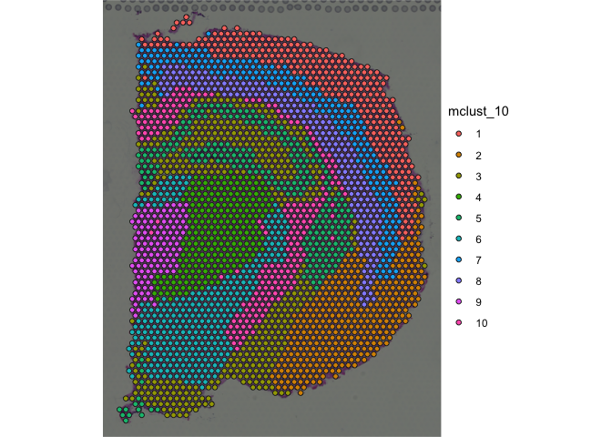

<!-- README.md is generated from README.Rmd. Please edit that file -->

# spatialCCC 

<!-- badges: start -->

[](https://github.com/dolchan/spatialCCC/actions/workflows/R-CMD-check.yaml)

<!-- badges: end -->

The goal of **spatialCCC** package is to investigate cell-cell
signaling, by analyzing ligand-receptor interactions in spatial
transcriptomic data.

## Installation

You can install the development version of spatialCCC from
[GitHub](https://github.com/) with:

``` r
# install.packages("devtools")
devtools::install_github("dolchan/spatialCCC")
```

## Example

This is a basic example which shows you a basic workflow of the package:

## Load necessary packages

``` r
library(SpatialExperiment)
library(scater)
library(dplyr)
library(tidyr)
library(magrittr)
library(purrr)
library(ggplot2)
library(patchwork)

library(ggraph)
library(tidygraph)
library(RColorBrewer)

library(ggtree)
```

### Load spatialCCC package

``` r
library(spatialCCC)
## basic example code
```

## Ligand-Receptor Database

### Load built-in LRdb

This LRdb is downloaded from CellTalkDB:
\[<http://tcm.zju.edu.cn/celltalkdb/download.php>\]. You can see the
detail by:

``` r
?LRdb_human
?LRdb_mouse
```

We also created getter functions, get_LRdb() and get_LRdb_small(), to
retrieve the database.

``` r
LRdb_m <- 
  get_LRdb_small("mouse")

LRdb_m %>% 
  arrange(ligand_gene_symbol, receptor_gene_symbol)
#> # A tibble: 105 × 10
#>    LR    ligand_gene_symbol receptor_gene_symbol ligand_gene_id receptor_gene_id
#>    <chr> <chr>              <chr>                         <dbl>            <dbl>
#>  1 Ada_… Ada                Dpp4                          11486            13482
#>  2 Adam… Adam10             Il6ra                         11487            16194
#>  3 Adam… Adam10             Notch1                        11487            18128
#>  4 Adam… Adam17             Cd40                          11491            21939
#>  5 Apoa… Apoa1              Abca1                         11806            11303
#>  6 Apob… Apob               Cd36                         238055            12491
#>  7 Apob… Apob               Lrp1                         238055            16971
#>  8 Apob… Apob               Lrp2                         238055            14725
#>  9 Apoe… Apoe               Sdc1                          11816            20969
#> 10 App_… App                Dcc                           11820            13176
#> # ℹ 95 more rows
#> # ℹ 5 more variables: ligand_ensembl_protein_id <chr>,
#> #   receptor_ensembl_protein_id <chr>, ligand_ensembl_gene_id <chr>,
#> #   receptor_ensembl_gene_id <chr>, evidence <chr>
```

## Load Visium spatial transcriptomic data

``` r
data_dir <- file.path("example", "visium_tutorial")
spe_brain <-
  SpatialExperiment::read10xVisium(samples = data_dir,
                                   type = "HDF5",
                                   data = "filtered")

# to keep track of cell IDs
# spe_brain[["cell_id"]] <- colnames(spe_brain)

# Log-Normalize
spe_brain <- logNormCounts(spe_brain) 
```

## Cell cluster data

Now, let’s read cell cluster data, obtained using
[GraphST](https://deepst-tutorials.readthedocs.io/).

``` r
cell_clusters <-
  read.csv("example/visium_tutorial/outs/graphST.csv", row.names = 1)

# Make sure the rows of cell_clusters are in the same order of spe_brain.
cell_clusters <- cell_clusters[colnames(spe_brain), ]

cluster_ids <- colnames(cell_clusters)
cluster_ids <- cluster_ids[grep("mclust_", cluster_ids)]

for (cid in cluster_ids) {
  spe_brain[[cid]] <- factor(cell_clusters[[cid]])
}
```

``` r
plot_spatial_feature(spe = spe_brain, feature = "mclust_10")
```



## Compute Cell-Cell Communications over ligand-receptor pairs

``` r
# For full LRdb analysis, future::plan can be used 
#   for parallelization
# future::plan(future::multisession, workers = 4)

tictoc::tic()
ccc_tbl <- compute_spatial_ccc(spe = spe_brain, 
                               assay_name = "logcounts",
                               LRdb = LRdb_m)
tictoc::toc()
#> 7.124 sec elapsed

# future::plan(future::sequential)
```

``` r
ccc_tbl %>% 
  dplyr::arrange(desc(LRscore))
#> # A tibble: 131,750 × 10
#>    src         dst       d norm.d LR    ligand receptor LRscore  weight WLRscore
#>    <chr>       <chr> <dbl>  <dbl> <chr> <chr>  <chr>      <dbl>   <dbl>    <dbl>
#>  1 GGAGCGAGGC… CCTA…  138.   1.01 Ptn_… Ptn    Sdc2       0.848   0.980    0.830
#>  2 TCCGTTTAGC… AGGG…  138.   1.01 Sst_… Sst    Sstr2      0.848   0.980    0.830
#>  3 TATAGTTAGG… TACG…  138.   1.01 Ptn_… Ptn    Sdc2       0.847   0.980    0.830
#>  4 GAGGTACGCG… CCTA…  138.   1.01 Ptn_… Ptn    Sdc2       0.843   0.987    0.832
#>  5 TCGCGTCCAG… TCGC…    0    0    App_… App    Ncstn      0.842 Inf      Inf    
#>  6 AGTCTGGACA… AGTC…    0    0    App_… App    Ncstn      0.841 Inf      Inf    
#>  7 GCGAGAGTTG… GCGA…    0    0    Ptn_… Ptn    Sdc2       0.840 Inf      Inf    
#>  8 GCGAGAGTTG… ACTT…  138.   1.01 Ptn_… Ptn    Sdc2       0.840   0.980    0.822
#>  9 AACTTCTGCG… AGTC…  138    1.01 App_… App    Ncstn      0.838   0.986    0.826
#> 10 CCCTCATTCT… GAGT…  138.   1.01 App_… App    Ncstn      0.836   0.980    0.819
#> # ℹ 131,740 more rows
```

``` r
ccc_tbl <-
  ccc_tbl %>%
  amend_ccc_table_with_cell_annots(spe = spe_brain, annot_cols = c("mclust_8", "mclust_10"))
```

### Convert CCC table to CCC graph

The conversion also adds various graph metrics to each CCC graph.

``` r
tictoc::tic("to_spatical_ccc_graph ...")

sp_col_data <- get_spatial_data(spe_brain)

ccc_graph_list <-
  to_spatial_ccc_graph_list(ccc_tbl, sp_col_data, workers = 6)

tictoc::toc()
#> to_spatical_ccc_graph ...: 12.019 sec elapsed
```

summarize_ccc_graph_metrics() summarize those graph metrics for each LR
pair.

``` r
tictoc::tic()

ccc_graph_metrics_summary_df <-
  summarize_ccc_graph_metrics(ccc_graph_list)

tictoc::toc()
#> 0.068 sec elapsed
```

``` r
ccc_graph_metrics_summary_df %>%
  arrange(graph_component_count)
#> # A tibble: 50 × 12
#>    LR        graph_n_nodes graph_n_edges graph_component_count graph_motif_count
#>    <chr>             <int>         <dbl>                 <dbl>             <int>
#>  1 Egfl7_It…          2338          8135                     3             15373
#>  2 App_Ncstn          2675         11287                     3             21977
#>  3 Ptn_Sdc2           2608          9614                     3             18582
#>  4 Cx3cl1_I…          2617         11724                     4             21978
#>  5 S100a1_R…          2591         10689                     5             20094
#>  6 Efnb3_Ep…          2381          7807                     6             15265
#>  7 Bsg_Cav1           2237          4470                    23              9423
#>  8 Wnt10a_F…            92            74                    32                48
#>  9 Flt3l_Fl…            80            55                    34                14
#> 10 Cxcl12_G…          1763          3223                    42              5310
#> # ℹ 40 more rows
#> # ℹ 7 more variables: graph_diameter <dbl>, graph_un_diameter <dbl>,
#> #   graph_mean_dist <dbl>, graph_circuit_rank <dbl>, graph_reciprocity <dbl>,
#> #   graph_clique_num <int>, graph_clique_count <int>
```

summarize_ccc_graph_metrics(…, level = “group”) summarizes the metrics
for each subgraph (group) in CCC graph (LR)

``` r
tictoc::tic()

ccc_graph_group_metrics_summary_df <-
  summarize_ccc_graph_metrics(ccc_graph_list, level = "group")

tictoc::toc()
#> 0.066 sec elapsed
```

``` r
ccc_graph_group_metrics_summary_df 
#> # A tibble: 3,855 × 12
#>    LR       group group_n_nodes group_n_edges group_adhesion group_motif_count
#>    <chr>    <int>         <int>         <dbl>          <dbl>             <int>
#>  1 Bsg_Cav1     1          1913          3970              0              8432
#>  2 Bsg_Cav1     6            18            23              0                44
#>  3 Bsg_Cav1    19             5             5              0                 6
#>  4 Bsg_Cav1     2            63           134              0               276
#>  5 Bsg_Cav1    14             7             7              0                15
#>  6 Bsg_Cav1     5            23            28              0                65
#>  7 Bsg_Cav1     7            17            22              0                43
#>  8 Bsg_Cav1    15             7             7              0                15
#>  9 Bsg_Cav1    12             8            11              0                15
#> 10 Bsg_Cav1     4            24            42              0                87
#> # ℹ 3,845 more rows
#> # ℹ 6 more variables: group_diameter <dbl>, group_un_diameter <dbl>,
#> #   group_mean_dist <dbl>, group_girth <dbl>, group_circuit_rank <dbl>,
#> #   group_reciprocity <dbl>
```

## Visualization

``` r
LR_of_interest <- "App_Dcc"
```

``` r
ccc_graph_list[[LR_of_interest]] %>%
  activate(edges) %>%
  as_tibble()
#> # A tibble: 3,822 × 38
#>     from    to src      dst       d norm.d LR    ligand receptor LRscore  weight
#>    <int> <int> <chr>    <chr> <dbl>  <dbl> <chr> <chr>  <chr>      <dbl>   <dbl>
#>  1     1   577 AAACAAG… CAGC…  138    1.01 App_… App    Dcc        0.745   0.986
#>  2     1  1938 AAACAAG… TTCT…  138.   1.01 App_… App    Dcc        0.685   0.980
#>  3     2  1569 AAACAAT… TAGT…  138    1.01 App_… App    Dcc        0.739   0.986
#>  4     3  1251 AAACACC… GGAA…  138    1.01 App_… App    Dcc        0.671   0.986
#>  5     4     4 AAACAGA… AAAC…    0    0    App_… App    Dcc        0.798 Inf    
#>  6     4   581 AAACAGA… CAGC…  138.   1.01 App_… App    Dcc        0.771   0.980
#>  7     5     5 AAACCGG… AAAC…    0    0    App_… App    Dcc        0.728 Inf    
#>  8     5   805 AAACCGG… CGCC…  138.   1.01 App_… App    Dcc        0.726   0.980
#>  9     6   699 AAACCTC… CCGA…  138.   1.01 App_… App    Dcc        0.701   0.980
#> 10     6  1324 AAACCTC… GGTA…  138.   1.01 App_… App    Dcc        0.714   0.980
#> # ℹ 3,812 more rows
#> # ℹ 27 more variables: WLRscore <dbl>, mclust_8.src <chr>, mclust_10.src <chr>,
#> #   mclust_8.dst <chr>, mclust_10.dst <chr>, graph_n_nodes <int>,
#> #   graph_n_edges <dbl>, graph_component_count <dbl>, graph_motif_count <int>,
#> #   graph_diameter <dbl>, graph_un_diameter <dbl>, graph_mean_dist <dbl>,
#> #   graph_circuit_rank <dbl>, graph_reciprocity <dbl>, graph_clique_num <int>,
#> #   graph_clique_count <int>, group <int>, group_n_nodes <int>, …
```

### spatial CCC graph plot with tissue image

``` r
gp_spccc <-
  plot_spatial_ccc_graph(
    ccc_graph = ccc_graph_list[[LR_of_interest]],
    tissue_img = imgRaster(spe_brain),
    node_color = "mclust_7",
    node_size = 1,
    node_alpha = 0.5,
    edge_color = "group_diameter",
    # clip = TRUE,
    which_on_top = "edge"
  )

gp_spccc_0 <-
  plot_spatial_feature(spe = spe_brain,
                       feature = "mclust_8")
```

``` r
wrap_plots(gp_spccc, gp_spccc_0, ncol = 2)
```


``` r
ccc_graph_temp <-
  ccc_graph_list[[LR_of_interest]] %>%
  tidygraph::activate("edges") %>%
  tidygraph::filter(mclust_8.src != mclust_8.dst) %>%
  tidy_up_ccc_graph()

cells_of_interest <-
  ccc_graph_temp %>%
  tidygraph::activate("nodes") %>%
  dplyr::pull("name")
```

``` r
gp_spccc <-
  plot_spatial_ccc_graph(
    ccc_graph = ccc_graph_temp,
    tissue_img = SpatialExperiment::imgRaster(spe_brain),
    edges_expanded_to_group = FALSE,
    node_color = "mclust_8",
    node_size = 1.5,
    node_alpha = 0.5,
    edge_color = "group_n_edges",
    edge_width = 4,
    # clip = TRUE,
    which_on_top = "node"
  )

gp_spccc_0 <-
  plot_spatial_ccc_graph(
    ccc_graph = ccc_graph_list[[LR_of_interest]],
    tissue_img = SpatialExperiment::imgRaster(spe_brain),
    cells_of_interest = cells_of_interest,
    edges_expanded_to_group = FALSE,
    node_color = "mclust_8",
    node_size = 1,
    node_alpha = 0.5,
    edge_color = "group_n_edges",
    # clip = TRUE,
    which_on_top = "node"
  )

gp_spccc_1 <-
  plot_spatial_feature(spe = spe_brain,
                       feature = "mclust_8",
                       cells_of_interest = cells_of_interest)
```

``` r
wrap_plots(gp_spccc, gp_spccc_1, ncol = 2)
```


### spatial CCC graph plot without tissue image

In this case, graph layout can be “spatial” which keeps the original
spatial locations, or other graph layout algorithm supported by igraph
package.

``` r
gp_spccc <-
  plot_spatial_ccc_graph(
    ccc_graph = ccc_graph_list[[LR_of_interest]],
    graph_layout = "spatial",
    node_color =  "mclust_8",
    node_size = 1,
    edge_color = "group_diameter",
    clip = TRUE,
    # ghost_img = TRUE,
    which_on_top = "edge"
  )

gp_spccc_0 <-
  plot_spatial_ccc_graph(
    ccc_graph =
      ccc_graph_list[[LR_of_interest]],
    graph_layout = "spatial",
    node_color = "mclust_8",
    node_size = 1,
    edge_color = "group_diameter",
    clip = TRUE,
    # ghost_img = TRUE,
    which_on_top = "node"
  )
```

``` r
wrap_plots(gp_spccc, gp_spccc_0, ncol = 2, guides = "collect")
```


Below uses “auto” layout (“kk” spring layout).

``` r
plot_spatial_ccc_graph(ccc_graph = ccc_graph_list[[LR_of_interest]],
                       # tissue_img = imgRaster(spe_brain),
                       node_color = "group",
                       node_size = 0.1,
                       edge_color = "group_diameter",
                       edge_width = 0.1,
                       which_on_top = "edge")
```


In this case, below is “stress” layout.

``` r
plot_spatial_ccc_graph(ccc_graph = ccc_graph_list[[LR_of_interest]],
                       # tissue_img = imgRaster(spe_brain),
                       graph_layout = "stress",
                       node_color = "group",
                       edge_color = "group_diameter",
                       edge_width = 0.25,
                       which_on_top = "edge")
```


## Cell-overlap distance

``` r
tictoc::tic()

cell_overlap_dist <-
  dist_cell_overlap_ccc_tbl(ccc_tbl)

tictoc::toc()
#> 0.38 sec elapsed
```

``` r
tictoc::tic()

cell_overlap_lf <-
  lf_cell_overlap_ccc_tbl(ccc_tbl)

tictoc::toc()
#> 0.42 sec elapsed
```

``` r
tictoc::tic()

LRs_high_cell_overlap <-
  cell_overlap_lf %>% 
  dplyr::filter(d < 1) %>%
  dplyr::select(lr1, lr2) %>%
  unlist() %>% unique()

tictoc::toc()
#> 0.002 sec elapsed
```

``` r
tictoc::tic()

high_cell_overlap_dist <-
  cell_overlap_dist[LRs_high_cell_overlap, LRs_high_cell_overlap]

tictoc::toc()
#> 0.001 sec elapsed
```

``` r
tictoc::tic()

high_cell_overlap_dist2 <-
  cell_overlap_lf %>%
  dplyr::filter(d < 1) %>%
  dplyr::select(lr1, lr2, d) %>%
  lf_to_dist()

tictoc::toc()
#> 0.007 sec elapsed
```

``` r
LR_ccc_summary_tbl <-
  ccc_tbl %>% 
  pull(LR) %>%
  table() %>%
  as_tibble() %>%
  rename("LR" = ".") %>%
  arrange(desc(n)) %>%
  left_join(
    ccc_tbl %>% 
      select(LR, ligand, receptor) %>%
      distinct(),
    by = "LR"
  )
```

``` r
hclus.res <- fastcluster::hclust(as.dist(high_cell_overlap_dist),
                                 method = "complete")
```

``` r
ape::as.phylo(hclus.res) %>%
  ggtree(layout="dendrogram") %<+% LR_ccc_summary_tbl +
  aes(color=receptor) +
  theme(legend.position = "none") +
  geom_tippoint(aes(size=n), alpha=0.5) +
  geom_tiplab(size=2, offset=-0.15) +
  xlim_tree(3)
```


``` r
ape::as.phylo(hclus.res) %>%
  ggtree(layout = "circular") %<+% LR_ccc_summary_tbl +
  aes(color=receptor) +
  # aes(color=ligand) +
  theme(legend.position = "none") +
  geom_tippoint(aes(size=n), alpha=0.5) +
  geom_tiplab(size=2, offset=0.05)
```


