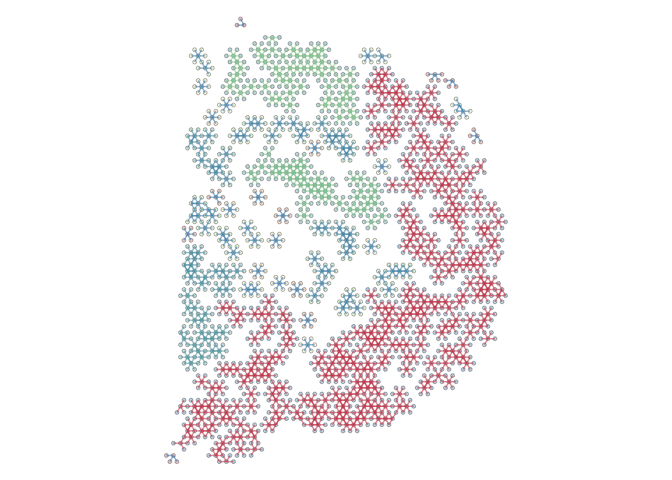

<!-- README.md is generated from README.Rmd. Please edit that file -->

# spatialCCC 

<!-- badges: start -->

[](https://github.com/dolchan/spatialCCC/actions/workflows/R-CMD-check.yaml)

<!-- badges: end -->

The goal of **spatialCCC** package is to investigate cell-cell
signaling, by analyzing ligand-receptor interactions in spatial
transcriptomic data.

## Installation

You can install the development version of spatialCCC from
[GitHub](https://github.com/) with:

``` r
# install.packages("devtools")
devtools::install_github("dolchan/spatialCCC")
```

# Example

This is a basic example which shows you a basic workflow of the package:

### Load necessary packages

``` r
library(SpatialExperiment)
library(scater)
library(dplyr)
library(tidyr)
library(magrittr)
library(purrr)
library(ggplot2)
library(patchwork)

library(ggraph)
library(tidygraph)
library(RColorBrewer)

library(ggtree)
```

### Load spatialCCC package

``` r
library(spatialCCC)
## basic example code
```

## Ligand-Receptor Database

### Load built-in LRdb

``` r
LRdb_mm <- 
  get_LRdb("mouse")

LRdb_m <-
  LRdb_mm %>%
  slice_sample(n = 100)

LR_pair_list <- c(
  "Apoe_Sdc1",
  "App_Dcc",
  "Cxcl12_Ackr3",
  "Jam3_Itgam",
  "Cx3cl1_Itga4")

LRdb_m <-
  rbind(LRdb_m,
        dplyr::filter(LRdb_mm, LR %in% LR_pair_list)) %>%
  distinct()

LRdb_m %>% 
  arrange(ligand_gene_symbol, receptor_gene_symbol)
#> # A tibble: 104 × 10
#>    LR    ligand_gene_symbol receptor_gene_symbol ligand_gene_id receptor_gene_id
#>    <chr> <chr>              <chr>                         <dbl>            <dbl>
#>  1 Ada_… Ada                Dpp4                          11486            13482
#>  2 Adam… Adam10             Gpnmb                         11487            93695
#>  3 Adm2… Adm2               Ramp3                        223780            56089
#>  4 Afdn… Afdn               Nectin1                       17356            58235
#>  5 Agt_… Agt                Agtr1a                        11606            11607
#>  6 Agt_… Agt                Agtr1b                        11606            11608
#>  7 Angp… Angpt1             Tek                           11600            21687
#>  8 Anxa… Anxa1              Fpr2                          16952            14289
#>  9 Apob… Apob               Lsr                          238055            54135
#> 10 Apoe… Apoe               Sdc1                          11816            20969
#> # ℹ 94 more rows
#> # ℹ 5 more variables: ligand_ensembl_protein_id <chr>,
#> #   receptor_ensembl_protein_id <chr>, ligand_ensembl_gene_id <chr>,
#> #   receptor_ensembl_gene_id <chr>, evidence <chr>
```

## Load Visium spatial transcriptomic data

``` r
data_dir <- file.path("example", "visium_tutorial")
spe <- SpatialExperiment::read10xVisium(samples = data_dir, type = "HDF5", data = "filtered")
```

### Log-Normalize

``` r
spe <- logNormCounts(spe) 
```

## Compute Cell-Cell Communications over ligand-receptor pairs

``` r
# For full LRdb analysis, future::plan can be used 
#   for parallelization
# future::plan(future::multisession, workers = 4)

tictoc::tic()
ccc_tbl <- compute_spatial_ccc(spe = spe, 
                               assay_name = "logcounts",
                               LRdb = LRdb_m)
tictoc::toc()
#> 7.105 sec elapsed

# future::plan(future::sequential)
```

``` r
ccc_tbl %>% 
  dplyr::arrange(desc(LRscore))
#> # A tibble: 113,420 × 10
#>    src          dst       d norm.d LR    ligand receptor LRscore weight WLRscore
#>    <chr>        <chr> <dbl>  <dbl> <chr> <chr>  <chr>      <dbl>  <dbl>    <dbl>
#>  1 TAACTCCATGG… GACA…  137    1    Apoe… Apoe   Vldlr      0.864  1        0.864
#>  2 GAGGTCCCAAA… GACA…  138.   1.01 Apoe… Apoe   Vldlr      0.856  0.987    0.845
#>  3 TAACAAAGGGA… TACG…  138    1.01 Apoe… Apoe   Vldlr      0.856  0.986    0.844
#>  4 TTCAAAGTCTC… TATT…  138.   1.00 Apoe… Apoe   Vldlr      0.856  0.992    0.849
#>  5 GTCCCAACGTA… TATT…  138.   1.01 Apoe… Apoe   Vldlr      0.855  0.980    0.837
#>  6 TTCCGCGTGAG… ATAA…  138.   1.01 Apoe… Apoe   Vldlr      0.854  0.980    0.837
#>  7 CCATCGCAGTT… AATT…  138.   1.01 Apoe… Apoe   Vldlr      0.854  0.980    0.837
#>  8 TGTTCGTATTG… AATT…  137    1    Apoe… Apoe   Vldlr      0.854  1        0.854
#>  9 ATAAACGGACC… ATAA…  137    1    Apoe… Apoe   Vldlr      0.854  1        0.854
#> 10 CCCGCGCAATG… GACA…  138    1.01 Apoe… Apoe   Vldlr      0.854  0.986    0.841
#> # ℹ 113,410 more rows
```

### Convert CCC table to CCC graph

The conversion also adds various graph metrics to each CCC graph.

``` r
tictoc::tic("to_spatical_ccc_graph ...")

sp_col_data <- get_spatial_coords(spe)

ccc_graph_list <-
  to_spatial_ccc_graph_list(ccc_tbl, sp_col_data, workers = 4)

tictoc::toc()
#> to_spatical_ccc_graph ...: 13.492 sec elapsed
```

summarize_ccc_graph_metrics() summarize those graph metrics for each LR
pair.

``` r
tictoc::tic()

ccc_graph_metrics_summary_df <-
  summarize_ccc_graph_metrics(ccc_graph_list)

tictoc::toc()
#> 0.067 sec elapsed
```

``` r
ccc_graph_metrics_summary_df %>%
  arrange(graph_component_count)
#> # A tibble: 53 × 12
#>    LR        graph_n_nodes graph_n_edges graph_component_count graph_motif_count
#>    <chr>             <int>         <dbl>                 <dbl>             <int>
#>  1 Apoe_Vld…          2666          9078                     3             20960
#>  2 Egfl7_It…          2338          6933                     3             15373
#>  3 S100b_Al…          2657         11612                     3             24055
#>  4 Clu_Lrp8           2527          6413                     6             15497
#>  5 Cxcl12_I…          2163          5070                     8             10795
#>  6 Efna3_Ep…          2193          7103                    11             15015
#>  7 App_Adra…          2284          4922                    20             11788
#>  8 Ntng1_Lr…          2175          5445                    21             12090
#>  9 Sema4a_P…          1800          3511                    25              7024
#> 10 Afdn_Nec…          1899          3915                    30              8028
#> # ℹ 43 more rows
#> # ℹ 7 more variables: graph_diameter <dbl>, graph_un_diameter <dbl>,
#> #   graph_mean_dist <dbl>, graph_circuit_rank <dbl>, graph_reciprocity <dbl>,
#> #   graph_clique_num <int>, graph_clique_count <int>
```

summarize_ccc_graph_metrics(…, level = “group”) summarizes the metrics
for each subgraph (group) in CCC graph (LR)

``` r
tictoc::tic()

ccc_graph_group_metrics_summary_df <-
  summarize_ccc_graph_metrics(ccc_graph_list, level = "group")

tictoc::toc()
#> 0.065 sec elapsed
```

``` r
ccc_graph_group_metrics_summary_df 
#> # A tibble: 3,962 × 12
#>    LR         group group_n_nodes group_n_edges group_adhesion group_motif_count
#>    <chr>      <int>         <int>         <dbl>          <dbl>             <int>
#>  1 Sema4a_Pl…     1          1614          3312              0              6761
#>  2 Sema4a_Pl…    11             5             5              0                 4
#>  3 Sema4a_Pl…     5            12            15              0                25
#>  4 Sema4a_Pl…     4            23            33              0                46
#>  5 Sema4a_Pl…    13             4             3              0                 2
#>  6 Sema4a_Pl…     6            12            18              0                17
#>  7 Sema4a_Pl…     3            29            34              0                55
#>  8 Sema4a_Pl…    12             5             4              0                 3
#>  9 Sema4a_Pl…    17             3             2              0                 1
#> 10 Sema4a_Pl…     2            34            38              0                57
#> # ℹ 3,952 more rows
#> # ℹ 6 more variables: group_diameter <dbl>, group_un_diameter <dbl>,
#> #   group_mean_dist <dbl>, group_girth <dbl>, group_circuit_rank <dbl>,
#> #   group_reciprocity <dbl>
```

## Visualization

``` r
LR_of_interest <- "App_Dcc"
```

### spatial CCC graph plot with tissue image

``` r
plot_spatial_ccc_graph(ccc_graph = ccc_graph_list[[LR_of_interest]],
                       tissue_img = imgRaster(spe),
                       node_color = "group_diameter",
                       node_size = 1,
                       edge_color = "group_diameter",
                       which_on_top = "edge")
```


### spatial CCC graph plot without tissue image

In this case, graph layout can be “manual” which keeps the original
spatial locations, or other graph layout algorithm supported by igraph
package. Below uses “auto” layout (“kk” spring layout)

``` r
plot_spatial_ccc_graph(ccc_graph = ccc_graph_list[[LR_of_interest]],
                       # tissue_img = imgRaster(spe),
                       node_color = "group",
                       node_size = 0.1,
                       edge_color = "group_diameter",
                       edge_width = 0.1,
                       which_on_top = "edge")
```


In this case, below is “stress” layout.

``` r
plot_spatial_ccc_graph(ccc_graph = ccc_graph_list[[LR_of_interest]],
                       # tissue_img = imgRaster(spe),
                       graph_layout = "stress",
                       node_color = "group",
                       edge_color = "group_diameter",
                       edge_width = 0.25,
                       which_on_top = "edge")
```


``` r
tictoc::tic()

cell_overlap_dist <-
  dist_cell_overlap_ccc_tbl(ccc_tbl)

tictoc::toc()
#> 0.399 sec elapsed
```

``` r
tictoc::tic()

cell_overlap_lf <-
  lf_cell_overlap_ccc_tbl(ccc_tbl)

tictoc::toc()
#> 0.373 sec elapsed
```

``` r
tictoc::tic()

LRs_high_cell_overlap <-
  cell_overlap_lf %>% 
  dplyr::filter(d < 1) %>%
  dplyr::select(lr1, lr2) %>%
  unlist() %>% unique()

tictoc::toc()
#> 0.002 sec elapsed
```

``` r
tictoc::tic()

high_cell_overlap_dist <-
  cell_overlap_dist[LRs_high_cell_overlap, LRs_high_cell_overlap]

tictoc::toc()
#> 0.001 sec elapsed
```

``` r
tictoc::tic()

high_cell_overlap_dist2 <-
  cell_overlap_lf %>%
  dplyr::filter(d < 1) %>%
  dplyr::select(lr1, lr2, d) %>%
  lf_to_dist()

tictoc::toc()
#> 0.006 sec elapsed
```

``` r
LR_ccc_summary_tbl <-
  ccc_tbl %>% 
  pull(LR) %>%
  table() %>%
  as_tibble() %>%
  rename("LR" = ".") %>%
  arrange(desc(n)) %>%
  left_join(
    ccc_tbl %>% 
      select(LR, ligand, receptor) %>%
      distinct(),
    by = "LR"
  )
```

``` r
hclus.res <- fastcluster::hclust(as.dist(high_cell_overlap_dist),
                                 method = "complete")
```

``` r
ape::as.phylo(hclus.res) %>%
  ggtree(layout="dendrogram") %<+% LR_ccc_summary_tbl +
  aes(color=receptor) +
  theme(legend.position = "none") +
  geom_tippoint(aes(size=n), alpha=0.5) +
  geom_tiplab(size=2, offset=-0.15) +
  xlim_tree(3)
```


``` r
ape::as.phylo(hclus.res) %>%
  ggtree(layout = "circular") %<+% LR_ccc_summary_tbl +
  aes(color=receptor) +
  # aes(color=ligand) +
  theme(legend.position = "none") +
  geom_tippoint(aes(size=n), alpha=0.5) +
  geom_tiplab(size=2, offset=0.05)
```


``` r
gp_hex <-
  ccc_graph_list[[LR_of_interest]] %>%
  plot_spatial_ccc_graph(
    tissue_img = imgRaster(spe),
    clip = TRUE,
    node_color = "group",
    node_size = 1,
    edge_color = "group_n_edges",
    edge_width = 0.5,
    ghost_img = TRUE,
    which_on_top = "edge"
  ) +
  theme(legend.position = "none")

gp_hex
```



``` r
library(hexSticker)
gp_hex_sticker <- sticker(
  gp_hex,
  package = "spatialCCC",
  # p_color = "#1F1F1F",
  p_color = "snow",
  p_family = "sans",
  p_fontface = "bold",
  p_y = 1.1,
  p_size = 40,
  
  s_x = 1.0,
  s_y = 1.2,
  s_width = 5,
  s_height = 5*3/4,
  
  # h_fill = "purple",
  h_color = "snow",
  h_size = 1.5,
  
  # spotlight = TRUE,
  # l_x = 1.0,
  # l_y = 0.4,
  # l_alpha = 0.25,
  
  filename = "spatialCCC.png",
  dpi = 600
)
```
