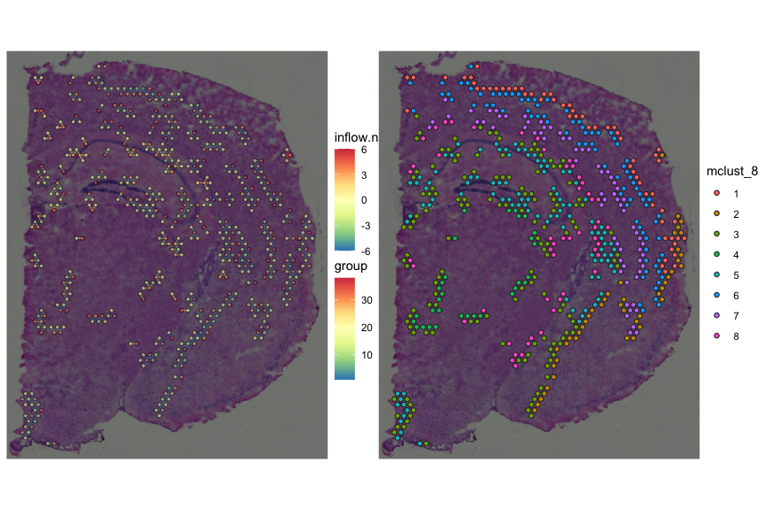
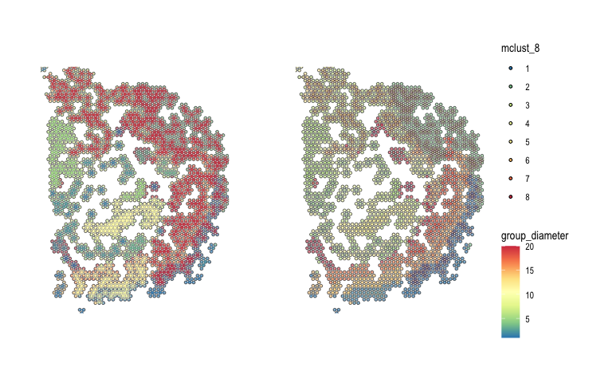

<!-- README.md is generated from README.Rmd. Please edit that file -->

# spatialCCC 

<!-- badges: start -->

[](https://github.com/dolchan/spatialCCC/actions/workflows/R-CMD-check.yaml)

<!-- badges: end -->

The goal of **spatialCCC** package is to investigate cell-cell
signaling, by analyzing ligand-receptor interactions in spatial
transcriptomic data.

## Installation

You can install the development version of spatialCCC from
[GitHub](https://github.com/) with:

``` r
# install.packages("devtools")
devtools::install_github("dolchan/spatialCCC")
```

## Example

This is a basic example which shows you a basic workflow of the package:

## Load necessary packages

``` r
library(SpatialExperiment)
library(scater)
library(dplyr)
library(tidyr)
library(magrittr)
library(purrr)
library(ggplot2)
library(patchwork)

library(ggraph)
library(tidygraph)
library(RColorBrewer)

library(ggtree)
```

### Load spatialCCC package

``` r
library(spatialCCC)
## basic example code
```

## Ligand-Receptor Database

### Load built-in LRdb

This LRdb is downloaded from CellTalkDB:
\[<http://tcm.zju.edu.cn/celltalkdb/download.php>\]. You can see the
detail by:

``` r
?LRdb_human
?LRdb_mouse
```

We also created getter function, get_LRdb(), to retrieve the database.

``` r
LRdb_m <- 
  get_LRdb_small("mouse")

LRdb_m %>% 
  arrange(ligand_gene_symbol, receptor_gene_symbol)
#> # A tibble: 105 × 10
#>    LR    ligand_gene_symbol receptor_gene_symbol ligand_gene_id receptor_gene_id
#>    <chr> <chr>              <chr>                         <dbl>            <dbl>
#>  1 Adam… Adam12             Itga9                         11489           104099
#>  2 Adam… Adam17             Itgb6                         11491            16420
#>  3 Adam… Adam17             Rhbdf2                        11491           217344
#>  4 Adam… Adam9              Itgb5                         11502            16419
#>  5 Alka… Alkal2             Alk                       100294583            11682
#>  6 Amh_… Amh                Amhr2                         11705           110542
#>  7 Angp… Angptl3            Itgb3                         30924            16416
#>  8 Anxa… Anxa1              Fpr2                          16952            14289
#>  9 Apob… Apob               Cd36                         238055            12491
#> 10 Apoc… Apoc3              Ldlr                          11814            16835
#> # ℹ 95 more rows
#> # ℹ 5 more variables: ligand_ensembl_protein_id <chr>,
#> #   receptor_ensembl_protein_id <chr>, ligand_ensembl_gene_id <chr>,
#> #   receptor_ensembl_gene_id <chr>, evidence <chr>
```

## Load Visium spatial transcriptomic data

``` r
data_dir <- file.path("example", "visium_tutorial")
spe <-
  SpatialExperiment::read10xVisium(samples = data_dir,
                                   type = "HDF5",
                                   data = "filtered")
# Log-Normalize
spe <- logNormCounts(spe) 
```

## Cell cluster data

Now, let’s read cell cluster data, obtained using
[GraphST](https://deepst-tutorials.readthedocs.io/).

``` r
cell_clusters <-
  readr::read_csv("example/visium_tutorial/outs/graphST.csv",
                  show_col_types = FALSE)

cell_clusters <-
  cell_clusters %>%
  # taking only "mclust_", arranged from mclust_6, ..., mclust_11
  dplyr::select(cell_id, all_of(paste0("mclust_", 6:11))) %>%
  dplyr::mutate_at(vars(matches("mclust_")), factor)

spe_annot <-
  colData(spe) %>%
  tibble::as_tibble(rownames = "cell_id") %>%
  left_join(cell_clusters, by = "cell_id")

colData(spe) <-
  DataFrame(spe_annot %>% select(-cell_id), 
            row.names = spe_annot$cell_id)
```

## Compute Cell-Cell Communications over ligand-receptor pairs

``` r
# For full LRdb analysis, future::plan can be used 
#   for parallelization
# future::plan(future::multisession, workers = 4)

tictoc::tic()
ccc_tbl <- compute_spatial_ccc(spe = spe, 
                               assay_name = "logcounts",
                               LRdb = LRdb_m)
tictoc::toc()
#> 7.142 sec elapsed

# future::plan(future::sequential)
```

``` r
ccc_tbl %>% 
  dplyr::arrange(desc(LRscore))
#> # A tibble: 128,873 × 10
#>    src         dst       d norm.d LR    ligand receptor LRscore  weight WLRscore
#>    <chr>       <chr> <dbl>  <dbl> <chr> <chr>  <chr>      <dbl>   <dbl>    <dbl>
#>  1 TCTTCTATAA… TCTT…    0    0    Apoe… Apoe   Lrp1       0.885 Inf      Inf    
#>  2 TTGTTAGCAA… TTGT…    0    0    Apoe… Apoe   Lrp1       0.881 Inf      Inf    
#>  3 ACCGCGGTGG… TCTT…  138.   1.00 Apoe… Apoe   Lrp1       0.880   0.992    0.873
#>  4 GCAACAGCAG… TCTT…  138.   1.01 Apoe… Apoe   Lrp1       0.879   0.980    0.861
#>  5 TGCTGGTTGG… TTGT…  138.   1.01 Apoe… Apoe   Lrp1       0.878   0.980    0.860
#>  6 TCGTCCGCTG… TTGT…  137    1    Apoe… Apoe   Lrp1       0.877   1        0.877
#>  7 CCATGCTCTG… TTGT…  138.   1.01 Apoe… Apoe   Lrp1       0.876   0.980    0.858
#>  8 GTTATTAACG… GTTA…    0    0    Apoe… Apoe   Lrp1       0.875 Inf      Inf    
#>  9 ATCGCCAGTC… TCTT…  138    1.01 Apoe… Apoe   Lrp1       0.875   0.986    0.863
#> 10 TTCGCTATCT… GGCT…  138.   1.01 Apoe… Apoe   Lrp1       0.875   0.980    0.857
#> # ℹ 128,863 more rows
```

Let’s add cell cluster IDs to ccc_tbl, one for `src` and the other for
`dst`.

``` r
ccc_tbl <-
  ccc_tbl %>% 
  dplyr::left_join(cell_clusters %>% 
                     select(cell_id, mclust_7), by = c("src" = "cell_id")) %>%
  dplyr::rename("cluster_src" = "mclust_7") %>%
  dplyr::left_join(cell_clusters %>%
                     select(cell_id, mclust_7), by = c("dst" = "cell_id")) %>%
  dplyr::rename("cluster_dst" = "mclust_7")
```

### Convert CCC table to CCC graph

The conversion also adds various graph metrics to each CCC graph.

``` r
tictoc::tic("to_spatical_ccc_graph ...")

sp_col_data <- get_spatial_data(spe)

ccc_graph_list <-
  to_spatial_ccc_graph_list(ccc_tbl, sp_col_data, workers = 6)

tictoc::toc()
#> to_spatical_ccc_graph ...: 12.054 sec elapsed
```

summarize_ccc_graph_metrics() summarize those graph metrics for each LR
pair.

``` r
tictoc::tic()

ccc_graph_metrics_summary_df <-
  summarize_ccc_graph_metrics(ccc_graph_list)

tictoc::toc()
#> 0.061 sec elapsed
```

``` r
ccc_graph_metrics_summary_df %>%
  arrange(graph_component_count)
#> # A tibble: 45 × 12
#>    LR        graph_n_nodes graph_n_edges graph_component_count graph_motif_count
#>    <chr>             <int>         <dbl>                 <dbl>             <int>
#>  1 Apoe_Lrp1          2701         17454                     3             27822
#>  2 Egfl7_It…          2338          8135                     3             15373
#>  3 Calm3_Kc…          2694         13606                     3             24413
#>  4 App_Lrp8           2524          7503                     6             15469
#>  5 Calm2_Ad…          2396          6832                     7             14032
#>  6 Sema4d_P…          2110          6156                     9             11215
#>  7 Calm3_Gr…          2544          8044                     9             16327
#>  8 Adam9_It…          1975          4639                    19              8156
#>  9 Hras_Gri…          2177          5633                    19             11524
#> 10 Adam12_I…            85            61                    35                21
#> # ℹ 35 more rows
#> # ℹ 7 more variables: graph_diameter <dbl>, graph_un_diameter <dbl>,
#> #   graph_mean_dist <dbl>, graph_circuit_rank <dbl>, graph_reciprocity <dbl>,
#> #   graph_clique_num <int>, graph_clique_count <int>
```

`summarize_ccc_graph_metrics(..., level = "group")` summarizes the
metrics for each subgraph (group) in CCC graph (LR)

``` r
tictoc::tic()

ccc_graph_group_metrics_summary_df <-
  summarize_ccc_graph_metrics(ccc_graph_list, level = "group")

tictoc::toc()
#> 0.058 sec elapsed
```

``` r
ccc_graph_group_metrics_summary_df 
#> # A tibble: 3,506 × 12
#>    LR       group group_n_nodes group_n_edges group_adhesion group_motif_count
#>    <chr>    <int>         <int>         <dbl>          <dbl>             <int>
#>  1 Kitl_Kit     9            19            31              0                55
#>  2 Kitl_Kit    23            10            12              0                22
#>  3 Kitl_Kit    55             3             2              0                 1
#>  4 Kitl_Kit    20            12            20              0                32
#>  5 Kitl_Kit     8            20            26              0                37
#>  6 Kitl_Kit    56             3             2              0                 1
#>  7 Kitl_Kit    11            18            26              0                53
#>  8 Kitl_Kit    10            19            23              0                36
#>  9 Kitl_Kit     5            35            59              0                90
#> 10 Kitl_Kit    37             6             6              0                10
#> # ℹ 3,496 more rows
#> # ℹ 6 more variables: group_diameter <dbl>, group_un_diameter <dbl>,
#> #   group_mean_dist <dbl>, group_girth <dbl>, group_circuit_rank <dbl>,
#> #   group_reciprocity <dbl>
```

## Visualization

``` r
LR_of_interest <- "App_Dcc"
```

``` r
ccc_graph_list[[LR_of_interest]] %>%
  activate(edges) %>%
  as_tibble()
#> # A tibble: 3,822 × 36
#>     from    to src      dst       d norm.d LR    ligand receptor LRscore  weight
#>    <int> <int> <chr>    <chr> <dbl>  <dbl> <chr> <chr>  <chr>      <dbl>   <dbl>
#>  1     1   577 AAACAAG… CAGC…  138    1.01 App_… App    Dcc        0.745   0.986
#>  2     1  1938 AAACAAG… TTCT…  138.   1.01 App_… App    Dcc        0.685   0.980
#>  3     2  1569 AAACAAT… TAGT…  138    1.01 App_… App    Dcc        0.739   0.986
#>  4     3  1251 AAACACC… GGAA…  138    1.01 App_… App    Dcc        0.671   0.986
#>  5     4     4 AAACAGA… AAAC…    0    0    App_… App    Dcc        0.798 Inf    
#>  6     4   581 AAACAGA… CAGC…  138.   1.01 App_… App    Dcc        0.771   0.980
#>  7     5     5 AAACCGG… AAAC…    0    0    App_… App    Dcc        0.728 Inf    
#>  8     5   805 AAACCGG… CGCC…  138.   1.01 App_… App    Dcc        0.726   0.980
#>  9     6   699 AAACCTC… CCGA…  138.   1.01 App_… App    Dcc        0.701   0.980
#> 10     6  1324 AAACCTC… GGTA…  138.   1.01 App_… App    Dcc        0.714   0.980
#> # ℹ 3,812 more rows
#> # ℹ 25 more variables: WLRscore <dbl>, cluster_src <chr>, cluster_dst <chr>,
#> #   graph_n_nodes <int>, graph_n_edges <dbl>, graph_component_count <dbl>,
#> #   graph_motif_count <int>, graph_diameter <dbl>, graph_un_diameter <dbl>,
#> #   graph_mean_dist <dbl>, graph_circuit_rank <dbl>, graph_reciprocity <dbl>,
#> #   graph_clique_num <int>, graph_clique_count <int>, group <int>,
#> #   group_n_nodes <int>, group_n_edges <dbl>, group_adhesion <dbl>, …
```

### spatial CCC graph plot with tissue image

``` r
gp_spccc <-
  plot_spatial_ccc_graph(
    ccc_graph = ccc_graph_list[[LR_of_interest]],
    tissue_img = imgRaster(spe),
    node_color = "mclust_7",
    node_size = 1,
    node_alpha = 0.5,
    edge_color = "group_diameter",
    # clip = TRUE,
    which_on_top = "edge"
  )

gp_spccc_0 <-
  plot_spatial_feature(spe = spe,
                       feature = "mclust_7")
```

``` r
wrap_plots(gp_spccc, gp_spccc_0, ncol = 2)
```


``` r
gp_spccc <-
  plot_spatial_ccc_graph(
    ccc_graph = 
      ccc_graph_list[[LR_of_interest]] %>%
      tidygraph::activate(edges) %>%
      tidygraph::filter(cluster_src != cluster_dst),
    tissue_img = imgRaster(spe),
    node_color = "mclust_7",
    node_size = 1,
    node_alpha = 0.5,
    edge_color = "group_diameter",
    # clip = TRUE,
    which_on_top = "edge"
  )

gp_spccc_0 <-
  plot_spatial_ccc_graph(
    ccc_graph =
      ccc_graph_list[[LR_of_interest]] %>%
      tidygraph::activate(edges) %>%
      tidygraph::filter(cluster_src != cluster_dst),
    tissue_img = imgRaster(spe),
    node_color = "mclust_7",
    node_size = 1,
    node_alpha = 0.5,
    edge_color = "group_diameter",
    # clip = FALSE,
    image_alpha = 0.75,
    which_on_top = "edge"
  )
```

``` r
wrap_plots(gp_spccc, gp_spccc_0, ncol = 2, guides = "collect")
```



### spatial CCC graph plot without tissue image

In this case, graph layout can be “spatial” which keeps the original
spatial locations, or other graph layout algorithm supported by igraph
package.

``` r
gp_spccc <-
  plot_spatial_ccc_graph(
    ccc_graph = ccc_graph_list[[LR_of_interest]],
    graph_layout = "spatial",
    node_color =  "mclust_7",
    node_size = 1,
    edge_color = "group_diameter",
    clip = TRUE,
    # ghost_img = TRUE,
    which_on_top = "edge"
  )

gp_spccc_0 <-
  plot_spatial_ccc_graph(
    ccc_graph =
      ccc_graph_list[[LR_of_interest]],
    graph_layout = "spatial",
    node_color = "mclust_7",
    node_size = 1,
    edge_color = "group_diameter",
    clip = TRUE,
    # ghost_img = TRUE,
    which_on_top = "node"
  )
```

``` r
wrap_plots(gp_spccc, gp_spccc_0, ncol = 2, guides = "collect")
```



Below uses “auto” layout (“kk” spring layout).

``` r
plot_spatial_ccc_graph(ccc_graph = ccc_graph_list[[LR_of_interest]],
                       # tissue_img = imgRaster(spe),
                       node_color = "group",
                       node_size = 0.1,
                       edge_color = "group_diameter",
                       edge_width = 0.1,
                       which_on_top = "edge")
```


In this case, below is “stress” layout.

``` r
plot_spatial_ccc_graph(ccc_graph = ccc_graph_list[[LR_of_interest]],
                       # tissue_img = imgRaster(spe),
                       graph_layout = "stress",
                       node_color = "group",
                       edge_color = "group_diameter",
                       edge_width = 0.25,
                       which_on_top = "edge")
```


## Cell-overlap distance

``` r
tictoc::tic()

cell_overlap_dist <-
  dist_cell_overlap_ccc_tbl(ccc_tbl)

tictoc::toc()
#> 0.325 sec elapsed
```

``` r
tictoc::tic()

cell_overlap_lf <-
  lf_cell_overlap_ccc_tbl(ccc_tbl)

tictoc::toc()
#> 0.353 sec elapsed
```

``` r
tictoc::tic()

LRs_high_cell_overlap <-
  cell_overlap_lf %>% 
  dplyr::filter(d < 1) %>%
  dplyr::select(lr1, lr2) %>%
  unlist() %>% unique()

tictoc::toc()
#> 0.003 sec elapsed
```

``` r
tictoc::tic()

high_cell_overlap_dist <-
  cell_overlap_dist[LRs_high_cell_overlap, LRs_high_cell_overlap]

tictoc::toc()
#> 0 sec elapsed
```

``` r
tictoc::tic()

high_cell_overlap_dist2 <-
  cell_overlap_lf %>%
  dplyr::filter(d < 1) %>%
  dplyr::select(lr1, lr2, d) %>%
  lf_to_dist()

tictoc::toc()
#> 0.007 sec elapsed
```

``` r
LR_ccc_summary_tbl <-
  ccc_tbl %>% 
  pull(LR) %>%
  table() %>%
  as_tibble() %>%
  rename("LR" = ".") %>%
  arrange(desc(n)) %>%
  left_join(
    ccc_tbl %>% 
      select(LR, ligand, receptor) %>%
      distinct(),
    by = "LR"
  )
```

``` r
hclus.res <- fastcluster::hclust(as.dist(high_cell_overlap_dist),
                                 method = "complete")
```

``` r
ape::as.phylo(hclus.res) %>%
  ggtree(layout="dendrogram") %<+% LR_ccc_summary_tbl +
  aes(color=receptor) +
  theme(legend.position = "none") +
  geom_tippoint(aes(size=n), alpha=0.5) +
  geom_tiplab(size=2, offset=-0.15) +
  xlim_tree(3)
```


``` r
ape::as.phylo(hclus.res) %>%
  ggtree(layout = "circular") %<+% LR_ccc_summary_tbl +
  aes(color=receptor) +
  # aes(color=ligand) +
  theme(legend.position = "none") +
  geom_tippoint(aes(size=n), alpha=0.5) +
  geom_tiplab(size=2, offset=0.05)
```


