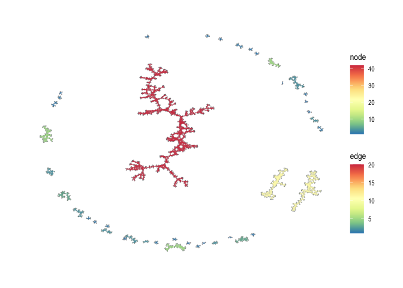
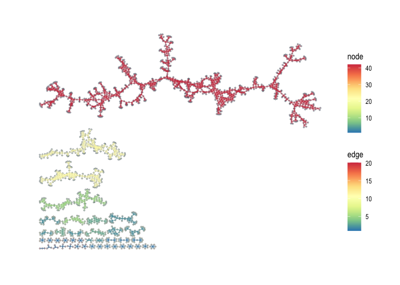
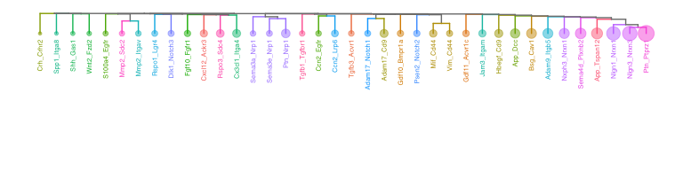
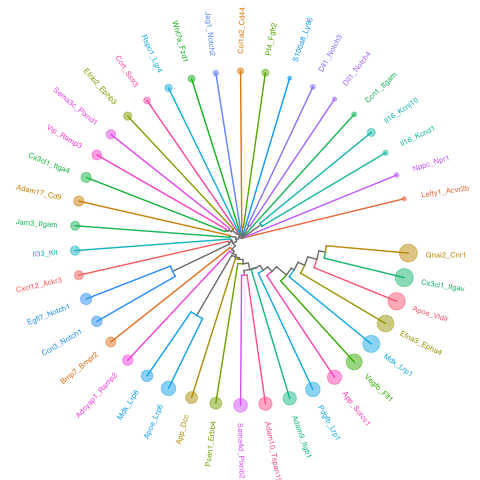
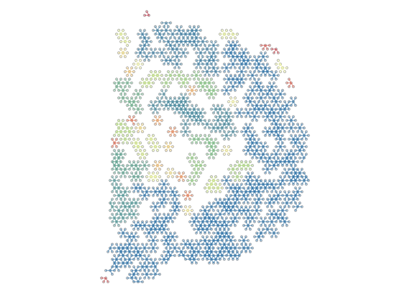

<!-- README.md is generated from README.Rmd. Please edit that file -->

# spatialCCC 

<!-- badges: start -->

[](https://github.com/dolchan/spatialCCC/actions/workflows/R-CMD-check.yaml)
<!-- badges: end -->

The goal of spatialCCC is to investigate cell-cell signaling, by
analyzing ligand-receptor interactions in spatial transcriptomic data.

## Installation

You can install the development version of spatialCCC from
[GitHub](https://github.com/) with:

``` r
# install.packages("devtools")
devtools::install_github("dolchan/spatialCCC")
```

## Example

This is a basic example which shows you a basic workflow of the package:

### Load necessary packages

``` r
library(SpatialExperiment)
library(scater)
library(dplyr)
library(tidyr)
library(magrittr)
library(purrr)
library(ggplot2)
library(patchwork)

library(ggraph)
library(tidygraph)
library(RColorBrewer)

library(ggtree)
```

### Load spatialCCC package

``` r
library(spatialCCC)
## basic example code
```

## Ligand-Receptor Database

### Load built-in LRdb

``` r
LRdb_mm <- 
  get_LRdb("mouse")

LRdb_m <-
  LRdb_mm %>%
  slice_sample(n = 100)

LR_pair_list <- c(
  "Apoe_Sdc1",
  "App_Dcc",
  "Cxcl12_Ackr3",
  "Jam3_Itgam",
  "Cx3cl1_Itga4")

LRdb_m <-
  rbind(LRdb_m,
        dplyr::filter(LRdb_mm, LR %in% LR_pair_list)) %>%
  distinct()

LRdb_m %>% 
  arrange(ligand_gene_symbol, receptor_gene_symbol)
#> # A tibble: 104 × 10
#>    LR    ligand_gene_symbol receptor_gene_symbol ligand_gene_id receptor_gene_id
#>    <chr> <chr>              <chr>                         <dbl>            <dbl>
#>  1 Adam… Adam10             Erbb2                         11487            13866
#>  2 Adam… Adam10             Tspan15                       11487            70423
#>  3 Adam… Adam17             Cd9                           11491            12527
#>  4 Adam… Adam17             Rhbdf2                        11491           217344
#>  5 Adam… Adam2              Cd9                           11495            12527
#>  6 Adam… Adam2              Itga6                         11495            16403
#>  7 Adam… Adam9              Itgb1                         11502            16412
#>  8 Adcy… Adcyap1            Ramp2                         11516            54409
#>  9 Apoe… Apoe               Lrp6                          11816            16974
#> 10 Apoe… Apoe               Sdc1                          11816            20969
#> # ℹ 94 more rows
#> # ℹ 5 more variables: ligand_ensembl_protein_id <chr>,
#> #   receptor_ensembl_protein_id <chr>, ligand_ensembl_gene_id <chr>,
#> #   receptor_ensembl_gene_id <chr>, evidence <chr>
```

## Load Visium spatial transcriptomic data

``` r
data_dir <- file.path("example", "visium_tutorial")
spe <- SpatialExperiment::read10xVisium(samples = data_dir, type = "HDF5", data = "filtered")
```

### Log-Normalize

``` r
spe <- logNormCounts(spe) 
```

## Compute Cell-Cell Communications over ligand-receptor pairs

``` r
# For full LRdb analysis, future::plan can be used 
#   for parallelization
# future::plan(future::multisession, workers = 4)

tictoc::tic()
ccc_tbl <- compute_spatial_ccc(spe = spe, 
                               assay_name = "logcounts",
                               LRdb = LRdb_m)
tictoc::toc()
#> 19.051 sec elapsed

# future::plan(future::sequential)
```

``` r
ccc_tbl %>% 
  dplyr::arrange(desc(LRscore))
#> # A tibble: 119,305 × 10
#>    src          dst       d norm.d LR    ligand receptor LRscore weight WLRscore
#>    <chr>        <chr> <dbl>  <dbl> <chr> <chr>  <chr>      <dbl>  <dbl>    <dbl>
#>  1 GTTCATCGTTT… GCGA…  138    1.01 Apoe… Apoe   Lrp6       0.869  0.986    0.857
#>  2 ACTTTACCCTC… GCGA…  138.   1.01 Apoe… Apoe   Lrp6       0.868  0.980    0.851
#>  3 AGATGATGGAG… GCGA…  138.   1.01 Apoe… Apoe   Lrp6       0.867  0.980    0.849
#>  4 TAACTCCATGG… GACA…  137    1    Apoe… Apoe   Vldlr      0.864  1        0.864
#>  5 GAGGTCCCAAA… GACA…  138.   1.01 Apoe… Apoe   Vldlr      0.856  0.987    0.845
#>  6 TAACAAAGGGA… TACG…  138    1.01 Apoe… Apoe   Vldlr      0.856  0.986    0.844
#>  7 TTCAAAGTCTC… TATT…  138.   1.00 Apoe… Apoe   Vldlr      0.856  0.992    0.849
#>  8 GTCCCAACGTA… TATT…  138.   1.01 Apoe… Apoe   Vldlr      0.855  0.980    0.837
#>  9 TTCCGCGTGAG… ATAA…  138.   1.01 Apoe… Apoe   Vldlr      0.854  0.980    0.837
#> 10 CCATCGCAGTT… AATT…  138.   1.01 Apoe… Apoe   Vldlr      0.854  0.980    0.837
#> # ℹ 119,295 more rows
```

### Convert CCC table to CCC graph

The conversion also adds various graph metrics to each CCC graph.

``` r
tictoc::tic("to_spatical_ccc_graph ...")

sp_col_data <- get_spatial_coords(spe)

ccc_graph_list <-
  to_spatial_ccc_graph_list(ccc_tbl, sp_col_data, workers = 4)

tictoc::toc()
#> to_spatical_ccc_graph ...: 30.46 sec elapsed
```

summarize_ccc_graph_metrics() summarize those graph metrics for each LR
pair.

``` r
tictoc::tic()

ccc_graph_metrics_summary_df <-
  summarize_ccc_graph_metrics(ccc_graph_list)

tictoc::toc()
#> 0.187 sec elapsed
```

``` r
ccc_graph_metrics_summary_df %>%
  arrange(graph_component_count)
#> # A tibble: 41 × 12
#>    LR        graph_n_nodes graph_n_edges graph_component_count graph_motif_count
#>    <chr>             <int>         <dbl>                 <dbl>             <int>
#>  1 Apoe_Vld…          2666          9078                     3             20960
#>  2 Cx3cl1_I…          2617         10002                     4             21978
#>  3 Mdk_Lrp1           2588          8606                     5             19447
#>  4 Vegfb_Fl…          2535          7161                     6             16833
#>  5 Gnai2_Cn…          2527          9723                     6             20558
#>  6 Pdgfb_Lr…          2429          5599                     7             13253
#>  7 Efna3_Ep…          2361          8104                     8             17563
#>  8 Apoe_Lrp6          2497          5640                     9             13761
#>  9 Sema4d_P…          2078          4840                    13             10292
#> 10 App_Sorc…          2378          5455                    14             13232
#> # ℹ 31 more rows
#> # ℹ 7 more variables: graph_diameter <dbl>, graph_un_diameter <dbl>,
#> #   graph_mean_dist <dbl>, graph_circuit_rank <dbl>, graph_reciprocity <dbl>,
#> #   graph_clique_num <int>, graph_clique_count <int>
```

summarize_ccc_graph_metrics(…, level = “group”) summarizes the metrics
for each subgraph (group) in CCC graph (LR)

``` r
tictoc::tic()

ccc_graph_group_metrics_summary_df <-
  summarize_ccc_graph_metrics(ccc_graph_list, level = "group")

tictoc::toc()
#> 0.152 sec elapsed
```

``` r
ccc_graph_group_metrics_summary_df 
#> # A tibble: 2,321 × 12
#>    LR       group group_n_nodes group_n_edges group_adhesion group_motif_count
#>    <chr>    <int>         <int>         <dbl>          <dbl>             <int>
#>  1 Mdk_Lrp6     9            14            18              0                19
#>  2 Mdk_Lrp6     1          1475          2684              0              5352
#>  3 Mdk_Lrp6    13            10            11              0                15
#>  4 Mdk_Lrp6    10            11            14              0                21
#>  5 Mdk_Lrp6    11            11            10              0                11
#>  6 Mdk_Lrp6     6            18            26              0                45
#>  7 Mdk_Lrp6     2            32            43              0                73
#>  8 Mdk_Lrp6    27             2             1              0                 0
#>  9 Mdk_Lrp6    16             5             4              0                 4
#> 10 Mdk_Lrp6    19             4             4              0                 3
#> # ℹ 2,311 more rows
#> # ℹ 6 more variables: group_diameter <dbl>, group_un_diameter <dbl>,
#> #   group_mean_dist <dbl>, group_girth <dbl>, group_circuit_rank <dbl>,
#> #   group_reciprocity <dbl>
```

## Visualization

``` r
LR_of_interest <- "App_Dcc"
```

### spatial CCC graph plot with tissue image

``` r
plot_spatial_ccc_graph(ccc_graph = ccc_graph_list[[LR_of_interest]],
                       tissue_img = imgRaster(spe),
                       node_color = "group_diameter",
                       node_size = 1,
                       edge_color = "group_diameter",
                       which_on_top = "edge")
```


### spatial CCC graph plot without tissue image

In this case, graph layout can be “manual” which keeps the original
spatial locations, or other graph layout algorithm supported by igraph
package. Below uses “auto” layout (“kk” spring layout)

``` r
plot_spatial_ccc_graph(ccc_graph = ccc_graph_list[[LR_of_interest]],
                       # tissue_img = imgRaster(spe),
                       node_color = "group",
                       node_size = 0.1,
                       edge_color = "group_diameter",
                       edge_width = 0.1,
                       which_on_top = "edge")
```



In this case, below is “stress” layout.

``` r
plot_spatial_ccc_graph(ccc_graph = ccc_graph_list[[LR_of_interest]],
                       # tissue_img = imgRaster(spe),
                       graph_layout = "stress",
                       node_color = "group",
                       edge_color = "group_diameter",
                       edge_width = 0.25,
                       which_on_top = "edge")
```



``` r
tictoc::tic()

cell_overlap_dist <-
  dist_cell_overlap_ccc_tbl(ccc_tbl)

tictoc::toc()
#> 0.65 sec elapsed
```

``` r
tictoc::tic()

cell_overlap_lf <-
  lf_cell_overlap_ccc_tbl(ccc_tbl)

tictoc::toc()
#> 0.72 sec elapsed
```

``` r
tictoc::tic()

LRs_high_cell_overlap <-
  cell_overlap_lf %>% 
  filter(d < 1) %>%
  select(lr1, lr2) %>%
  unlist() %>% unique()

tictoc::toc()
#> 0.005 sec elapsed
```

``` r
tictoc::tic()

high_cell_overlap_dist <-
  cell_overlap_dist[LRs_high_cell_overlap, LRs_high_cell_overlap]

tictoc::toc()
#> 0.002 sec elapsed
```

``` r
tictoc::tic()

high_cell_overlap_dist2 <-
  cell_overlap_lf %>%
  filter(d < 1) %>%
  select(lr1, lr2, d) %>%
  lf_to_dist()

tictoc::toc()
#> 0.018 sec elapsed
```

``` r
LR_ccc_summary_tbl <-
  ccc_tbl %>% 
  pull(LR) %>%
  table() %>%
  as_tibble() %>%
  rename("LR" = ".") %>%
  arrange(desc(n)) %>%
  left_join(
    ccc_tbl %>% 
      select(LR, ligand, receptor) %>%
      distinct(),
    by = "LR"
  )
```

``` r
hclus.res <- fastcluster::hclust(as.dist(high_cell_overlap_dist),
                                 method = "complete")
```

``` r
ape::as.phylo(hclus.res) %>%
  ggtree(layout="dendrogram") %<+% LR_ccc_summary_tbl +
  aes(color=receptor) +
  theme(legend.position = "none") +
  geom_tippoint(aes(size=n), alpha=0.5) +
  geom_tiplab(size=2, offset=-0.15) +
  xlim_tree(3)
```



``` r
ape::as.phylo(hclus.res) %>%
  ggtree(layout = "circular") %<+% LR_ccc_summary_tbl +
  aes(color=receptor) +
  # aes(color=ligand) +
  theme(legend.position = "none") +
  geom_tippoint(aes(size=n), alpha=0.5) +
  geom_tiplab(size=2, offset=0.05)
```



``` r
gp_hex <-
  ccc_graph_list[[LR_of_interest]] %>%
  plot_spatial_ccc_graph(
    tissue_img = imgRaster(spe),
    clip = TRUE,
    node_color = "group",
    node_size = 1,
    edge_color = "group",
    ghost_img = TRUE,
    which_on_top = "edge"
  ) +
  theme(legend.position = "none")

gp_hex
```



``` r
library(hexSticker)
gp_hex_sticker <- sticker(
  gp_hex,
  package = "spatialCCC",
  p_size = 20,
  s_x = 1.5,
  s_y = 0.5,
  s_width = 4,
  s_height = 4,
  filename = "spatialCCC.png"
)
```
