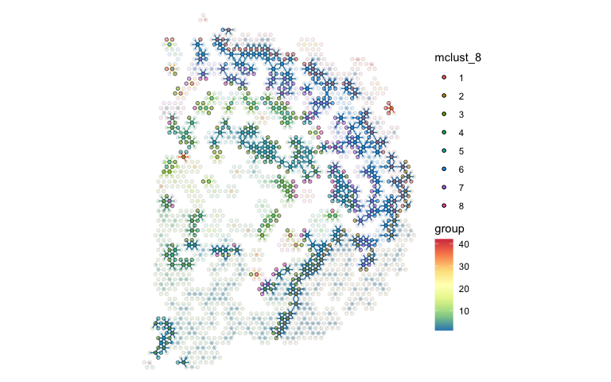

<!-- README.md is generated from README.Rmd. Please edit that file -->

# spatialCCC 

<!-- badges: start -->

[](https://github.com/dolchan/spatialCCC/actions/workflows/R-CMD-check.yaml)

<!-- badges: end -->

The goal of **spatialCCC** package is to investigate cell-cell
signaling, by analyzing ligand-receptor interactions in spatial
transcriptomic data.

## Installation

You can install the development version of spatialCCC from
[GitHub](https://github.com/) with:

``` r
# install.packages("devtools")
devtools::install_github("dolchan/spatialCCC")
```

## Example

This is a basic example which shows you a basic workflow of the package:

## Load necessary packages

``` r
# library(SpatialExperiment)
# library(scater)
# library(dplyr)
# library(tidyr)
# library(magrittr)
# library(purrr)
# library(ggplot2)
library(patchwork)

# Looks like ggraph might have some issue inmporting 'guide_edge_colourbar' 
library(ggraph)
# library(tidygraph)
# library(RColorBrewer)
# 
library(ggtree)
```

### Load spatialCCC package

``` r
library(spatialCCC)
## basic example code
```

## Ligand-Receptor Database

### Load built-in LRdb

This LRdb is downloaded from CellTalkDB:
\[<http://tcm.zju.edu.cn/celltalkdb/download.php>\]. You can see the
detail by:

``` r
?LRdb_human
?LRdb_mouse
```

We also created getter functions, get_LRdb() and get_LRdb_small(), to
retrieve the database.

``` r
LRdb_m <- 
  get_LRdb_small("mouse")

LRdb_m %>% 
  dplyr::arrange(ligand_gene_symbol, receptor_gene_symbol)
#> # A tibble: 105 × 10
#>    LR    ligand_gene_symbol receptor_gene_symbol ligand_gene_id receptor_gene_id
#>    <chr> <chr>              <chr>                         <dbl>            <dbl>
#>  1 Adam… Adam2              Itgb1                         11495            16412
#>  2 Afdn… Afdn               Nectin1                       17356            58235
#>  3 Agt_… Agt                Agtr1b                        11606            11608
#>  4 Angp… Angpt2             Itgb1                         11601            16412
#>  5 Angp… Angpt2             Tek                           11601            21687
#>  6 Apoc… Apoc1              Vldlr                         11812            22359
#>  7 Apoe… Apoe               Sdc1                          11816            20969
#>  8 App_… App                Dcc                           11820            13176
#>  9 App_… App                Lrp2                          11820            14725
#> 10 Bgn_… Bgn                Cd44                          12111            12505
#> # ℹ 95 more rows
#> # ℹ 5 more variables: ligand_ensembl_protein_id <chr>,
#> #   receptor_ensembl_protein_id <chr>, ligand_ensembl_gene_id <chr>,
#> #   receptor_ensembl_gene_id <chr>, evidence <chr>
```

## Load Visium spatial transcriptomic data

``` r
data_dir <- file.path("example", "visium_tutorial")
spe_brain <-
  SpatialExperiment::read10xVisium(samples = data_dir,
                                   type = "HDF5",
                                   data = "filtered")

# to keep track of cell IDs
# spe_brain[["cell_id"]] <- colnames(spe_brain)

# Log-Normalize
spe_brain <- scater::logNormCounts(spe_brain) 
```

## Cell cluster data

Now, let’s read cell cluster data, obtained using
[GraphST](https://deepst-tutorials.readthedocs.io/).

``` r
cell_clusters <-
  read.csv("example/visium_tutorial/outs/graphST.csv", row.names = 1)

# Make sure the rows of cell_clusters are in the same order of spe_brain.
cell_clusters <- cell_clusters[colnames(spe_brain), ]

cluster_ids <- colnames(cell_clusters)
cluster_ids <- cluster_ids[grep("mclust_", cluster_ids)]

for (cid in cluster_ids) {
  spe_brain[[cid]] <- factor(cell_clusters[[cid]])
}
```

``` r
plot_spatial_feature(spe = spe_brain, feature = "mclust_8")
```


## Compute Cell-Cell Communications over ligand-receptor pairs

``` r
# For full LRdb analysis, future::plan can be used 
#   for parallelization
# future::plan(future::multisession, workers = 4)

tictoc::tic()
ccc_tbl <- compute_spatial_ccc(spe = spe_brain, 
                               assay_name = "logcounts",
                               LRdb = LRdb_m)
tictoc::toc()
#> 7.172 sec elapsed

# future::plan(future::sequential)
```

``` r
ccc_tbl %>% 
  dplyr::arrange(desc(LRscore))
#> # A tibble: 140,680 × 10
#>    src          dst       d norm.d LR    ligand receptor LRscore weight WLRscore
#>    <chr>        <chr> <dbl>  <dbl> <chr> <chr>  <chr>      <dbl>  <dbl>    <dbl>
#>  1 GACGTGTAGGG… CTAA…  138    1.01 Col3… Col3a1 Mag        0.866  0.986    0.853
#>  2 GCAACAGCAGT… TCTT…  138.   1.01 Hsp9… Hsp90… Lrp1       0.859  0.980    0.842
#>  3 GCCACAATTTA… TCGC…  138    1.01 Hsp9… Hsp90… Lrp1       0.856  0.986    0.844
#>  4 TAGTGTCAGAA… GTTA…  138.   1.01 Hsp9… Hsp90… Lrp1       0.856  0.980    0.838
#>  5 CAGTGTTAATC… CAGG…  137.   1.00 Hsp9… Hsp90… Lrp1       0.855  0.999    0.855
#>  6 GCTGTATTACT… TCGC…  138.   1.00 Hsp9… Hsp90… Lrp1       0.854  0.992    0.847
#>  7 TTGAGAGTACT… TCGC…  138.   1.01 Hsp9… Hsp90… Lrp1       0.854  0.980    0.837
#>  8 GGGTATTCTAG… CAGA…  137    1    Hsp9… Hsp90… Lrp1       0.854  1        0.854
#>  9 GAATGCCGAAA… GTTA…  138.   1.01 Hsp9… Hsp90… Lrp1       0.853  0.980    0.836
#> 10 CACCGTATCCC… CACC…    0    0    Hsp9… Hsp90… Lrp1       0.853  1        0.853
#> # ℹ 140,670 more rows
```

### Add cluster lables to CCC table.

``` r
ccc_tbl <-
  ccc_tbl %>%
  amend_ccc_table_with_cell_annots(spe = spe_brain, annot_cols = c("mclust_8", "mclust_10")) %>%
  set_ccc_table_default_cluster("mclust_8")
```

### Summarize cell-cell communication between cell clusters

``` r
ccc_tbl_between_clusters <-
  ccc_tbl %>%
  dplyr::group_by(mclust_8.src, mclust_8.dst, LR) %>%
  dplyr::summarise(n = dplyr::n(),
                   LRscore.sum = sum(LRscore),
                   WLRscore.sum = sum(WLRscore))
#> `summarise()` has grouped output by 'mclust_8.src', 'mclust_8.dst'. You can
#> override using the `.groups` argument.

ccc_tbl_between_clusters %>%
  dplyr::arrange(desc(n))
#> # A tibble: 1,663 × 6
#> # Groups:   mclust_8.src, mclust_8.dst [46]
#>    mclust_8.src mclust_8.dst LR                n LRscore.sum WLRscore.sum
#>    <fct>        <fct>        <chr>         <int>       <dbl>        <dbl>
#>  1 3            3            Hsp90aa1_Lrp1  4494       3630.        3590.
#>  2 3            3            S100b_Alcam    3535       2562.        2534.
#>  3 3            3            Nlgn1_Nrxn1    2569       1780.        1761.
#>  4 2            2            Hsp90aa1_Lrp1  2136       1728.        1708.
#>  5 2            2            S100b_Alcam    1977       1449.        1432.
#>  6 3            3            Omg_Rtn4rl1    1747       1123.        1111.
#>  7 1            1            Hsp90aa1_Lrp1  1742       1411.        1396.
#>  8 3            3            Efnb3_Ephb1    1662       1080.        1068.
#>  9 3            3            Nptx2_Nptxr    1605       1057.        1045.
#> 10 2            2            Nlgn1_Nrxn1    1555       1146.        1133.
#> # ℹ 1,653 more rows
```

``` r
ccc_tbl_between_clusters %>%
  dplyr::filter(mclust_8.dst != mclust_8.src) %>%
  dplyr::arrange(desc(n))
#> # A tibble: 1,263 × 6
#> # Groups:   mclust_8.src, mclust_8.dst [38]
#>    mclust_8.src mclust_8.dst LR                n LRscore.sum WLRscore.sum
#>    <fct>        <fct>        <chr>         <int>       <dbl>        <dbl>
#>  1 3            5            Hsp90aa1_Lrp1   306        245.         242.
#>  2 5            3            Hsp90aa1_Lrp1   300        242.         238.
#>  3 3            5            S100b_Alcam     250        177.         175.
#>  4 8            3            Hsp90aa1_Lrp1   212        171.         169.
#>  5 3            8            Hsp90aa1_Lrp1   199        159.         157.
#>  6 5            3            S100b_Alcam     195        139.         137.
#>  7 5            3            Nlgn1_Nrxn1     194        137.         135.
#>  8 3            5            Omg_Rtn4rl1     172        119.         117.
#>  9 1            6            Hsp90aa1_Lrp1   145        118.         116.
#> 10 6            1            Hsp90aa1_Lrp1   145        117.         116.
#> # ℹ 1,253 more rows
```

### Convert CCC table to CCC graph

The conversion also adds various graph metrics to each CCC graph.

``` r
tictoc::tic("to_spatical_ccc_graph ...")

sp_col_data <- get_spatial_data(spe_brain)

ccc_graph_list <-
  to_spatial_ccc_graph_list(ccc_tbl, sp_col_data, workers = 6)

tictoc::toc()
#> to_spatical_ccc_graph ...: 14.087 sec elapsed
```

summarize_ccc_graph_metrics() summarize those graph metrics for each LR
pair.

``` r
tictoc::tic()

ccc_graph_metrics_summary_df <-
  summarize_ccc_graph_metrics(ccc_graph_list)

tictoc::toc()
#> 0.074 sec elapsed
```

``` r
ccc_graph_metrics_summary_df %>%
  dplyr::arrange(graph_component_count)
#> # A tibble: 50 × 12
#>    LR        graph_n_nodes graph_n_edges graph_component_count graph_motif_count
#>    <chr>             <int>         <dbl>                 <dbl>             <int>
#>  1 Hsp90aa1…          2702         17454                     3             27855
#>  2 Nlgn1_Nr…          2627         11042                     3             20957
#>  3 S100b_Al…          2657         13613                     3             24055
#>  4 Omg_Rtn4…          2475         10304                     6             18611
#>  5 Nptx2_Np…          2326          7406                    12             14136
#>  6 Efnb3_Ep…          2099          5832                    16             10830
#>  7 Cck_Cckbr          1944          6384                    26             12316
#>  8 Psen1_Er…          1794          3835                    30              6426
#>  9 Afdn_Nec…          1900          4589                    31              8028
#> 10 Jam3_Itg…          1988          5554                    35              9818
#> # ℹ 40 more rows
#> # ℹ 7 more variables: graph_diameter <dbl>, graph_un_diameter <dbl>,
#> #   graph_mean_dist <dbl>, graph_circuit_rank <dbl>, graph_reciprocity <dbl>,
#> #   graph_clique_num <int>, graph_clique_count <int>
```

summarize_ccc_graph_metrics(…, level = “group”) summarizes the metrics
for each subgraph (group) in CCC graph (LR)

``` r
tictoc::tic()

ccc_graph_group_metrics_summary_df <-
  summarize_ccc_graph_metrics(ccc_graph_list, level = "group")

tictoc::toc()
#> 0.076 sec elapsed
```

``` r
ccc_graph_group_metrics_summary_df 
#> # A tibble: 4,056 × 12
#>    LR        group group_n_nodes group_n_edges group_adhesion group_motif_count
#>    <chr>     <int>         <int>         <dbl>          <dbl>             <int>
#>  1 Tnc_Itga7    21             4             5              0                 3
#>  2 Tnc_Itga7    48             2             2              0                 0
#>  3 Tnc_Itga7     3            18            30              0                37
#>  4 Tnc_Itga7     5            11            15              0                25
#>  5 Tnc_Itga7     9             6             6              0                 5
#>  6 Tnc_Itga7     2            25            38              0                55
#>  7 Tnc_Itga7    31             3             2              0                 1
#>  8 Tnc_Itga7    32             3             2              0                 1
#>  9 Tnc_Itga7    33             3             3              0                 1
#> 10 Tnc_Itga7    49             2             1              0                 0
#> # ℹ 4,046 more rows
#> # ℹ 6 more variables: group_diameter <dbl>, group_un_diameter <dbl>,
#> #   group_mean_dist <dbl>, group_girth <dbl>, group_circuit_rank <dbl>,
#> #   group_reciprocity <dbl>
```

## Visualization

``` r
LR_of_interest <- "App_Dcc"
```

``` r
ccc_graph_list[[LR_of_interest]] %>%
  tidygraph::activate(edges) %>%
  tibble::as_tibble()
#> # A tibble: 3,822 × 40
#>     from    to src       dst       d norm.d LR    ligand receptor LRscore weight
#>    <int> <int> <chr>     <chr> <dbl>  <dbl> <chr> <chr>  <chr>      <dbl>  <dbl>
#>  1     1   577 AAACAAGT… CAGC…  138    1.01 App_… App    Dcc        0.745  0.986
#>  2     1  1938 AAACAAGT… TTCT…  138.   1.01 App_… App    Dcc        0.685  0.980
#>  3     2  1569 AAACAATC… TAGT…  138    1.01 App_… App    Dcc        0.739  0.986
#>  4     3  1251 AAACACCA… GGAA…  138    1.01 App_… App    Dcc        0.671  0.986
#>  5     4     4 AAACAGAG… AAAC…    0    0    App_… App    Dcc        0.798  1    
#>  6     4   581 AAACAGAG… CAGC…  138.   1.01 App_… App    Dcc        0.771  0.980
#>  7     5     5 AAACCGGG… AAAC…    0    0    App_… App    Dcc        0.728  1    
#>  8     5   805 AAACCGGG… CGCC…  138.   1.01 App_… App    Dcc        0.726  0.980
#>  9     6   699 AAACCTCA… CCGA…  138.   1.01 App_… App    Dcc        0.701  0.980
#> 10     6  1324 AAACCTCA… GGTA…  138.   1.01 App_… App    Dcc        0.714  0.980
#> # ℹ 3,812 more rows
#> # ℹ 29 more variables: WLRscore <dbl>, mclust_8.src <chr>, mclust_10.src <chr>,
#> #   mclust_8.dst <chr>, mclust_10.dst <chr>, cluster.src <chr>,
#> #   cluster.dst <chr>, graph_n_nodes <int>, graph_n_edges <dbl>,
#> #   graph_component_count <dbl>, graph_motif_count <int>, graph_diameter <dbl>,
#> #   graph_un_diameter <dbl>, graph_mean_dist <dbl>, graph_circuit_rank <dbl>,
#> #   graph_reciprocity <dbl>, graph_clique_num <int>, …
```

### spatial CCC graph plot with tissue image

``` r
gp_spccc <-
  plot_spatial_ccc_graph(
    ccc_graph = ccc_graph_list[[LR_of_interest]],
    tissue_img = SpatialExperiment::imgRaster(spe_brain),
    node_color = "mclust_8",
    node_size = 1,
    node_alpha = 0.5,
    edge_color = "group",
    # clip = TRUE,
    which_on_top = "edge"
  )

gp_spccc_0 <-
  plot_spatial_feature(spe = spe_brain,
                       feature = "mclust_8")
```

``` r
wrap_plots(gp_spccc, gp_spccc_0, ncol = 2)
```


``` r
ccc_graph_temp <-
  ccc_graph_list[[LR_of_interest]] %>%
  tidygraph::activate("edges") %>%
  tidygraph::filter(mclust_8.src != mclust_8.dst) %>%
  tidy_up_ccc_graph()

cells_of_interest <-
  ccc_graph_temp %>%
  tidygraph::activate("nodes") %>%
  dplyr::pull("name")
```

``` r
gp_spccc <-
  plot_spatial_ccc_graph(
    ccc_graph = ccc_graph_temp,
    tissue_img = SpatialExperiment::imgRaster(spe_brain),
    node_color = "inflow.n",
    node_size = 1.25,
    node_alpha = 1,
    edge_color = "group",
    show_arrow = TRUE,
    # clip = TRUE,
    which_on_top = "node"
  )

gp_spccc_0 <-
  plot_spatial_ccc_graph(
    ccc_graph = ccc_graph_list[[LR_of_interest]],
    tissue_img = SpatialExperiment::imgRaster(spe_brain),
    image_alpha = 0,
    cells_of_interest = cells_of_interest,
    edges_expanded_to_group = FALSE,
    node_color = "mclust_8",
    node_size = 1.25,
    node_alpha = 0.5,
    edge_color = "group",
    show_arrow = TRUE,
    # clip = TRUE,
    which_on_top = "node"
  )

gp_spccc_1 <-
  plot_spatial_feature(spe = spe_brain,
                       feature = "mclust_8",
                       cells_of_interest = cells_of_interest)
```

``` r
wrap_plots(gp_spccc, gp_spccc_1, ncol = 2)
```


``` r
gp_spccc_0
```



### spatial CCC graph plot without tissue image

In this case, graph layout can be “spatial” which keeps the original
spatial locations, or other graph layout algorithm supported by igraph
package.

``` r
gp_spccc <-
  plot_spatial_ccc_graph(
    ccc_graph = ccc_graph_list[[LR_of_interest]],
    graph_layout = "spatial",
    node_color =  "mclust_8",
    node_size = 1,
    edge_color = "group_diameter",
    clip = TRUE,
    # ghost_img = TRUE,
    which_on_top = "edge"
  )

gp_spccc_0 <-
  plot_spatial_ccc_graph(
    ccc_graph =
      ccc_graph_list[[LR_of_interest]],
    graph_layout = "spatial",
    node_color = "mclust_8",
    node_size = 1,
    edge_color = "group_diameter",
    clip = TRUE,
    # ghost_img = TRUE,
    which_on_top = "node"
  )
```

``` r
wrap_plots(gp_spccc, gp_spccc_0, ncol = 2, guides = "collect")
```


Below uses “auto” layout (“kk” spring layout).

``` r
plot_spatial_ccc_graph(ccc_graph = ccc_graph_list[[LR_of_interest]],
                       # tissue_img = SpatialExperiment::imgRaster(spe_brain),
                       node_color = "group",
                       node_size = 0.1,
                       edge_color = "group_diameter",
                       edge_width = 0.1,
                       which_on_top = "edge")
```


In this case, below is “stress” layout.

``` r
plot_spatial_ccc_graph(ccc_graph = ccc_graph_list[[LR_of_interest]],
                       # tissue_img = SpatialExperiment::imgRaster(spe_brain),
                       graph_layout = "stress",
                       node_color = "group",
                       edge_color = "group_diameter",
                       edge_width = 0.25,
                       which_on_top = "edge")
```


## Cell-overlap distance

``` r
tictoc::tic()

cell_overlap_dist <-
  dist_cell_overlap_ccc_tbl(ccc_tbl)

tictoc::toc()
#> 0.378 sec elapsed
```

``` r
tictoc::tic()

cell_overlap_lf <-
  lf_cell_overlap_ccc_tbl(ccc_tbl)

tictoc::toc()
#> 0.414 sec elapsed
```

``` r
tictoc::tic()

LRs_high_cell_overlap <-
  cell_overlap_lf %>% 
  dplyr::filter(d < 1) %>%
  dplyr::select(lr1, lr2) %>%
  unlist() %>% unique()

tictoc::toc()
#> 0.002 sec elapsed
```

``` r
tictoc::tic()

high_cell_overlap_dist <-
  cell_overlap_dist[LRs_high_cell_overlap, LRs_high_cell_overlap]

tictoc::toc()
#> 0.001 sec elapsed
```

``` r
tictoc::tic()

high_cell_overlap_dist2 <-
  cell_overlap_lf %>%
  dplyr::filter(d < 1) %>%
  dplyr::select(lr1, lr2, d) %>%
  lf_to_dist()

tictoc::toc()
#> 0.071 sec elapsed
```

``` r
LR_ccc_summary_tbl <-
  ccc_tbl %>% 
  dplyr::pull(LR) %>%
  table() %>%
  tibble::as_tibble() %>%
  dplyr::rename("LR" = ".") %>%
  dplyr::arrange(desc(n)) %>%
  dplyr::left_join(
    ccc_tbl %>% 
      dplyr::select(LR, ligand, receptor) %>%
      dplyr::distinct(),
    by = "LR"
  )
```

``` r
hclus.res <- fastcluster::hclust(as.dist(high_cell_overlap_dist),
                                 method = "complete")
```

``` r
ape::as.phylo(hclus.res) %>%
  ggtree(layout="dendrogram") %<+% LR_ccc_summary_tbl +
  aes(color=receptor) +
  theme(legend.position = "none") +
  geom_tippoint(aes(size=n), alpha=0.5) +
  geom_tiplab(size=2, offset=-0.15) +
  xlim_tree(3)
```


``` r
ape::as.phylo(hclus.res) %>%
  ggtree(layout = "circular") %<+% LR_ccc_summary_tbl +
  aes(color=receptor) +
  # aes(color=ligand) +
  theme(legend.position = "none") +
  geom_tippoint(aes(size=n), alpha=0.5) +
  geom_tiplab(size=2, offset=0.05)
```


