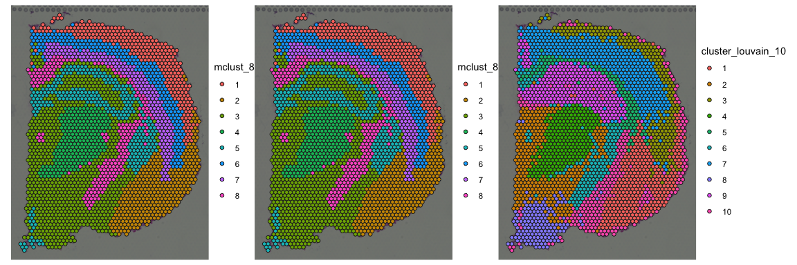

<!-- README.md is generated from README.Rmd. Please edit that file -->

# spatialCCC 

<!-- badges: start -->

[](https://github.com/dolchan/spatialCCC/actions/workflows/R-CMD-check.yaml)

<!-- badges: end -->

The goal of **spatialCCC** package is to investigate cell-cell
signaling, by analyzing ligand-receptor interactions in spatial
transcriptomic data.

## Installation

You can install the development version of spatialCCC from
[GitHub](https://github.com/) with:

``` r
# install.packages("devtools")
devtools::install_github("dolchan/spatialCCC")
```

## Example

This is a basic example which shows you a basic workflow of the package:

## Load necessary packages

``` r
library(SpatialExperiment)
library(scater)
library(dplyr)
library(tidyr)
library(magrittr)
library(purrr)
library(ggplot2)
library(patchwork)

library(ggraph)
library(tidygraph)
library(RColorBrewer)

library(ggtree)
```

### Load spatialCCC package

``` r
library(spatialCCC)
## basic example code
```

## Ligand-Receptor Database

### Load built-in LRdb

This LRdb is downloaded from CellTalkDB:
\[<http://tcm.zju.edu.cn/celltalkdb/download.php>\]. You can see the
detail by:

``` r
?LRdb_human
?LRdb_mouse
```

We also created getter functions, get_LRdb() and get_LRdb_small(), to
retrieve the database.

``` r
LRdb_m <- 
  get_LRdb_small("mouse")

LRdb_m %>% 
  arrange(ligand_gene_symbol, receptor_gene_symbol)
#> # A tibble: 105 × 10
#>    LR    ligand_gene_symbol receptor_gene_symbol ligand_gene_id receptor_gene_id
#>    <chr> <chr>              <chr>                         <dbl>            <dbl>
#>  1 Adam… Adam15             Itgb1                         11490            16412
#>  2 Adam… Adam17             Notch2                        11491            18129
#>  3 Adam… Adam9              Itgb5                         11502            16419
#>  4 Adam… Adamts3            Ccbe1                        330119           320924
#>  5 Adcy… Adcyap1            Ramp3                         11516            56089
#>  6 Angp… Angpt2             Itgb2                         11601            16414
#>  7 Apoe… Apoe               Lrp6                          11816            16974
#>  8 Apoe… Apoe               Sdc1                          11816            20969
#>  9 App_… App                Dcc                           11820            13176
#> 10 App_… App                Notch1                        11820            18128
#> # ℹ 95 more rows
#> # ℹ 5 more variables: ligand_ensembl_protein_id <chr>,
#> #   receptor_ensembl_protein_id <chr>, ligand_ensembl_gene_id <chr>,
#> #   receptor_ensembl_gene_id <chr>, evidence <chr>
```

## Load Visium spatial transcriptomic data

``` r
data_dir <- file.path("example", "visium_tutorial")
spe_brain <-
  SpatialExperiment::read10xVisium(samples = data_dir,
                                   type = "HDF5",
                                   data = "filtered")

# to keep track of cell IDs
# spe_brain[["cell_id"]] <- colnames(spe_brain)

# Log-Normalize
spe_brain <- logNormCounts(spe_brain) 
```

## Cell cluster data

Now, let’s read cell cluster data, obtained using
[GraphST](https://deepst-tutorials.readthedocs.io/).

``` r
cell_clusters <-
  read.csv("example/visium_tutorial/outs/graphST.csv", row.names = 1)

# Make sure the rows of cell_clusters are in the same order of spe_brain.
cell_clusters <- cell_clusters[colnames(spe_brain), ]

cluster_ids <- colnames(cell_clusters)
cluster_ids <- cluster_ids[grep("mclust_", cluster_ids)]

for (cid in cluster_ids) {
  spe_brain[[cid]] <- factor(cell_clusters[[cid]])
}
```

``` r
for (res in seq(0.6, 1.2, 0.2)) {
  clusters <-
    scran::quickCluster(
      spe_brain,
      method = "igraph",
      graph.fun = "louvain",
      cluster.args = list(resolution = res)
    )
  nc <- length(levels(clusters))
  spe_brain[[paste0("cluster_louvain_", nc)]] <-
    clusters
}
```

``` r
plot_spatial_feature(spe = spe_brain,
                     feature = "mclust_10") +
  plot_spatial_feature(spe = spe_brain,
                       feature = "cluster_louvain_10")
```


## Compute Cell-Cell Communications over ligand-receptor pairs

``` r
# For full LRdb analysis, future::plan can be used 
#   for parallelization
# future::plan(future::multisession, workers = 4)

tictoc::tic()
ccc_tbl <- compute_spatial_ccc(spe = spe_brain, 
                               assay_name = "logcounts",
                               LRdb = LRdb_m)
tictoc::toc()
#> 7.093 sec elapsed

# future::plan(future::sequential)
```

``` r
ccc_tbl %>% 
  dplyr::arrange(desc(LRscore))
#> # A tibble: 105,610 × 10
#>    src         dst       d norm.d LR    ligand receptor LRscore  weight WLRscore
#>    <chr>       <chr> <dbl>  <dbl> <chr> <chr>  <chr>      <dbl>   <dbl>    <dbl>
#>  1 GCGAGAGTTG… GCGA…    0    0    Apoe… Apoe   Lrp6       0.874 Inf      Inf    
#>  2 GTTCATCGTT… GCGA…  138    1.01 Apoe… Apoe   Lrp6       0.869   0.986    0.857
#>  3 ACTTTACCCT… GCGA…  138.   1.01 Apoe… Apoe   Lrp6       0.868   0.980    0.851
#>  4 AGATGATGGA… GCGA…  138.   1.01 Apoe… Apoe   Lrp6       0.867   0.980    0.849
#>  5 ACACATGATC… GCTG…  138    1.01 Apoe… Apoe   Lrp6       0.852   0.986    0.840
#>  6 TATTCAATTC… GGGA…  138.   1.01 Apoe… Apoe   Lrp6       0.851   0.980    0.834
#>  7 GGAGCGAGGC… GAGG…  137    1    Apoe… Apoe   Lrp6       0.851   1        0.851
#>  8 TGACGAATAT… TCGT…  138.   1.01 Apoe… Apoe   Lrp6       0.850   0.980    0.833
#>  9 GAGGTACGCG… GAGG…    0    0    Apoe… Apoe   Lrp6       0.850 Inf      Inf    
#> 10 GTCCCAACGT… GGGA…  138    1.01 Apoe… Apoe   Lrp6       0.850   0.986    0.837
#> # ℹ 105,600 more rows
```

Let’s add cell cluster IDs to ccc_tbl, one for `src` and the other for
`dst`.

``` r
ccc_tbl <-
  ccc_tbl %>%
  amend_ccc_table_with_cell_annots(spe = spe_brain, annot_cols = c("mclust_8", "mclust_10", "cluster_louvain_10"))
```

### Convert CCC table to CCC graph

The conversion also adds various graph metrics to each CCC graph.

``` r
tictoc::tic("to_spatical_ccc_graph ...")

sp_col_data <- get_spatial_data(spe_brain)

ccc_graph_list <-
  to_spatial_ccc_graph_list(ccc_tbl, sp_col_data, workers = 6)

tictoc::toc()
#> to_spatical_ccc_graph ...: 11.884 sec elapsed
```

summarize_ccc_graph_metrics() summarize those graph metrics for each LR
pair.

``` r
tictoc::tic()

ccc_graph_metrics_summary_df <-
  summarize_ccc_graph_metrics(ccc_graph_list)

tictoc::toc()
#> 0.063 sec elapsed
```

``` r
ccc_graph_metrics_summary_df %>%
  arrange(graph_component_count)
#> # A tibble: 46 × 12
#>    LR        graph_n_nodes graph_n_edges graph_component_count graph_motif_count
#>    <chr>             <int>         <dbl>                 <dbl>             <int>
#>  1 Adam15_I…          2344          8046                     4             15221
#>  2 S100b_Fg…          2579          9751                     4             18789
#>  3 Calm2_Ad…          2396          6832                     7             14032
#>  4 Apoe_Lrp6          2497          6612                     9             13761
#>  5 Vegfa_Sd…          1993          5096                    15              9112
#>  6 Vegfa_Fl…          1974          4676                    15              8407
#>  7 App_Notc…          2361          5282                    18             11122
#>  8 Adam9_It…          1975          4639                    19              8156
#>  9 Edn1_Edn…            88            64                    38                20
#> 10 App_Dcc            1989          3822                    42              8152
#> # ℹ 36 more rows
#> # ℹ 7 more variables: graph_diameter <dbl>, graph_un_diameter <dbl>,
#> #   graph_mean_dist <dbl>, graph_circuit_rank <dbl>, graph_reciprocity <dbl>,
#> #   graph_clique_num <int>, graph_clique_count <int>
```

`summarize_ccc_graph_metrics(..., level = "group")` summarizes the
metrics for each subgraph (group) in CCC graph (LR)

``` r
tictoc::tic()

ccc_graph_group_metrics_summary_df <-
  summarize_ccc_graph_metrics(ccc_graph_list, level = "group")

tictoc::toc()
#> 0.059 sec elapsed
```

``` r
ccc_graph_group_metrics_summary_df 
#> # A tibble: 3,614 × 12
#>    LR        group group_n_nodes group_n_edges group_adhesion group_motif_count
#>    <chr>     <int>         <int>         <dbl>          <dbl>             <int>
#>  1 Wnt2_Fzd4    11             3             2              0                 1
#>  2 Wnt2_Fzd4    12             3             3              0                 1
#>  3 Wnt2_Fzd4    21             2             2              0                 0
#>  4 Wnt2_Fzd4     4             5             5              0                 4
#>  5 Wnt2_Fzd4    13             3             2              0                 1
#>  6 Wnt2_Fzd4    22             2             1              0                 0
#>  7 Wnt2_Fzd4    14             3             2              0                 1
#>  8 Wnt2_Fzd4    23             2             1              0                 0
#>  9 Wnt2_Fzd4    24             2             1              0                 0
#> 10 Wnt2_Fzd4    25             2             1              0                 0
#> # ℹ 3,604 more rows
#> # ℹ 6 more variables: group_diameter <dbl>, group_un_diameter <dbl>,
#> #   group_mean_dist <dbl>, group_girth <dbl>, group_circuit_rank <dbl>,
#> #   group_reciprocity <dbl>
```

## Visualization

``` r
LR_of_interest <- "App_Dcc"
```

``` r
ccc_graph_list[[LR_of_interest]] %>%
  activate(edges) %>%
  as_tibble()
#> # A tibble: 3,822 × 40
#>     from    to src      dst       d norm.d LR    ligand receptor LRscore  weight
#>    <int> <int> <chr>    <chr> <dbl>  <dbl> <chr> <chr>  <chr>      <dbl>   <dbl>
#>  1     1   577 AAACAAG… CAGC…  138    1.01 App_… App    Dcc        0.745   0.986
#>  2     1  1938 AAACAAG… TTCT…  138.   1.01 App_… App    Dcc        0.685   0.980
#>  3     2  1569 AAACAAT… TAGT…  138    1.01 App_… App    Dcc        0.739   0.986
#>  4     3  1251 AAACACC… GGAA…  138    1.01 App_… App    Dcc        0.671   0.986
#>  5     4     4 AAACAGA… AAAC…    0    0    App_… App    Dcc        0.798 Inf    
#>  6     4   581 AAACAGA… CAGC…  138.   1.01 App_… App    Dcc        0.771   0.980
#>  7     5     5 AAACCGG… AAAC…    0    0    App_… App    Dcc        0.728 Inf    
#>  8     5   805 AAACCGG… CGCC…  138.   1.01 App_… App    Dcc        0.726   0.980
#>  9     6   699 AAACCTC… CCGA…  138.   1.01 App_… App    Dcc        0.701   0.980
#> 10     6  1324 AAACCTC… GGTA…  138.   1.01 App_… App    Dcc        0.714   0.980
#> # ℹ 3,812 more rows
#> # ℹ 29 more variables: WLRscore <dbl>, mclust_8.src <chr>, mclust_10.src <chr>,
#> #   cluster_louvain_10.src <chr>, mclust_8.dst <chr>, mclust_10.dst <chr>,
#> #   cluster_louvain_10.dst <chr>, graph_n_nodes <int>, graph_n_edges <dbl>,
#> #   graph_component_count <dbl>, graph_motif_count <int>, graph_diameter <dbl>,
#> #   graph_un_diameter <dbl>, graph_mean_dist <dbl>, graph_circuit_rank <dbl>,
#> #   graph_reciprocity <dbl>, graph_clique_num <int>, …
```

### spatial CCC graph plot with tissue image

``` r
gp_spccc <-
  plot_spatial_ccc_graph(
    ccc_graph = ccc_graph_list[[LR_of_interest]],
    tissue_img = imgRaster(spe_brain),
    node_color = "mclust_8",
    node_size = 1,
    node_alpha = 0.5,
    edge_color = "group_diameter",
    # clip = TRUE,
    which_on_top = "edge"
  )

gp_spccc_0 <-
  plot_spatial_feature(spe = spe_brain,
                       feature = "mclust_8")
```

``` r
wrap_plots(gp_spccc, gp_spccc_0, ncol = 2)
```


``` r
plot_spatial_feature(spe = spe_brain, feature = "mclust_8") +
  plot_spatial_feature(spe = spe_brain, feature = "mclust_8") +
  plot_spatial_feature(spe = spe_brain, feature = "cluster_louvain_10")
```



``` r
gp_spccc <-
  plot_spatial_ccc_graph(
    ccc_graph = 
      ccc_graph_list[[LR_of_interest]] %>%
      tidygraph::activate(edges) %>%
      tidygraph::filter(mclust_8.src != mclust_8.dst),
    tissue_img = imgRaster(spe_brain),
    node_color = "mclust_7",
    node_size = 1,
    node_alpha = 0.5,
    edge_color = "group_diameter",
    # clip = TRUE,
    which_on_top = "edge"
  )

gp_spccc_0 <-
  plot_spatial_ccc_graph(
    ccc_graph =
      ccc_graph_list[[LR_of_interest]] %>%
      tidygraph::activate(edges) %>%
      tidygraph::filter(mclust_8.src != mclust_8.dst),
    tissue_img = imgRaster(spe_brain),
    node_color = "mclust_7",
    node_size = 1,
    node_alpha = 0.5,
    edge_color = "group_diameter",
    # clip = FALSE,
    image_alpha = 0.75,
    which_on_top = "edge"
  )
```

``` r
wrap_plots(gp_spccc, gp_spccc_0, ncol = 2, guides = "collect")
```


### spatial CCC graph plot without tissue image

In this case, graph layout can be “spatial” which keeps the original
spatial locations, or other graph layout algorithm supported by igraph
package.

``` r
gp_spccc <-
  plot_spatial_ccc_graph(
    ccc_graph = ccc_graph_list[[LR_of_interest]],
    graph_layout = "spatial",
    node_color =  "mclust_8",
    node_size = 1,
    edge_color = "group_diameter",
    clip = TRUE,
    # ghost_img = TRUE,
    which_on_top = "edge"
  )

gp_spccc_0 <-
  plot_spatial_ccc_graph(
    ccc_graph =
      ccc_graph_list[[LR_of_interest]],
    graph_layout = "spatial",
    node_color = "mclust_8",
    node_size = 1,
    edge_color = "group_diameter",
    clip = TRUE,
    # ghost_img = TRUE,
    which_on_top = "node"
  )
```

``` r
wrap_plots(gp_spccc, gp_spccc_0, ncol = 2, guides = "collect")
```


Below uses “auto” layout (“kk” spring layout).

``` r
plot_spatial_ccc_graph(ccc_graph = ccc_graph_list[[LR_of_interest]],
                       # tissue_img = imgRaster(spe_brain),
                       node_color = "group",
                       node_size = 0.1,
                       edge_color = "group_diameter",
                       edge_width = 0.1,
                       which_on_top = "edge")
```


In this case, below is “stress” layout.

``` r
plot_spatial_ccc_graph(ccc_graph = ccc_graph_list[[LR_of_interest]],
                       # tissue_img = imgRaster(spe_brain),
                       graph_layout = "stress",
                       node_color = "group",
                       edge_color = "group_diameter",
                       edge_width = 0.25,
                       which_on_top = "edge")
```


## Cell-overlap distance

``` r
tictoc::tic()

cell_overlap_dist <-
  dist_cell_overlap_ccc_tbl(ccc_tbl)

tictoc::toc()
#> 0.293 sec elapsed
```

``` r
tictoc::tic()

cell_overlap_lf <-
  lf_cell_overlap_ccc_tbl(ccc_tbl)

tictoc::toc()
#> 0.356 sec elapsed
```

``` r
tictoc::tic()

LRs_high_cell_overlap <-
  cell_overlap_lf %>% 
  dplyr::filter(d < 1) %>%
  dplyr::select(lr1, lr2) %>%
  unlist() %>% unique()

tictoc::toc()
#> 0.003 sec elapsed
```

``` r
tictoc::tic()

high_cell_overlap_dist <-
  cell_overlap_dist[LRs_high_cell_overlap, LRs_high_cell_overlap]

tictoc::toc()
#> 0 sec elapsed
```

``` r
tictoc::tic()

high_cell_overlap_dist2 <-
  cell_overlap_lf %>%
  dplyr::filter(d < 1) %>%
  dplyr::select(lr1, lr2, d) %>%
  lf_to_dist()

tictoc::toc()
#> 0.006 sec elapsed
```

``` r
LR_ccc_summary_tbl <-
  ccc_tbl %>% 
  pull(LR) %>%
  table() %>%
  as_tibble() %>%
  rename("LR" = ".") %>%
  arrange(desc(n)) %>%
  left_join(
    ccc_tbl %>% 
      select(LR, ligand, receptor) %>%
      distinct(),
    by = "LR"
  )
```

``` r
hclus.res <- fastcluster::hclust(as.dist(high_cell_overlap_dist),
                                 method = "complete")
```

``` r
ape::as.phylo(hclus.res) %>%
  ggtree(layout="dendrogram") %<+% LR_ccc_summary_tbl +
  aes(color=receptor) +
  theme(legend.position = "none") +
  geom_tippoint(aes(size=n), alpha=0.5) +
  geom_tiplab(size=2, offset=-0.15) +
  xlim_tree(3)
```


``` r
ape::as.phylo(hclus.res) %>%
  ggtree(layout = "circular") %<+% LR_ccc_summary_tbl +
  aes(color=receptor) +
  # aes(color=ligand) +
  theme(legend.position = "none") +
  geom_tippoint(aes(size=n), alpha=0.5) +
  geom_tiplab(size=2, offset=0.05)
```


